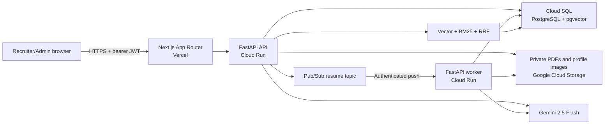
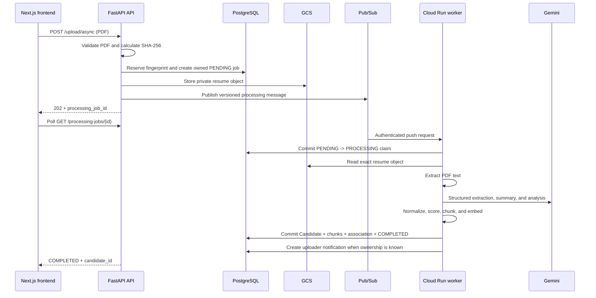

# AI Document Intelligence

### AI-Powered ATS Resume Intelligence Platform

AI Document Intelligence is a production-oriented Applicant Tracking System that turns PDF resumes into structured, searchable candidate records. It combines asynchronous document processing, Google Gemini extraction and analysis, profession-neutral candidate scoring, PostgreSQL/pgvector retrieval, explainable job matching, and recruiter-facing workflows in one full-stack application.

The platform is designed as an applied AI engineering project: LLM output is normalized and validated, deterministic scoring remains inspectable, retrieval is grounded in durable resume chunks, and cloud processing is observable and recoverable.

## Live project

- [Live frontend](https://ai-document-intelligence-nu.vercel.app)
- [Source repository](https://github.com/baramee-chaisuwan/AI-Document-Intelligence)
- [Retrieval evaluation methodology](docs/evaluation.md)

## Key features

### Resume processing

- Accepts PDF resumes through synchronous and asynchronous upload endpoints.
- Validates filename, size, non-empty content, PDF signature, and extractable text.
- Uses SHA-256 fingerprint reservations to reject exact duplicate files, including duplicates already being processed.
- Stores private resume objects in Google Cloud Storage (GCS).
- Persists durable processing jobs with `PENDING`, `PROCESSING`, `COMPLETED`, and `FAILED` states.
- Publishes versioned Pub/Sub messages for asynchronous processing by an authenticated Cloud Run worker.
- Commits the Candidate, resume chunks, processing-job association, and terminal completion state together.

### Structured AI extraction

- Uses **Gemini 2.5 Flash** with `application/json` structured output and a response schema.
- Extracts cross-domain evidence including skills, tools, certifications, achievements, responsibilities, domain expertise, leadership, languages, education, experience, and projects.
- Normalizes structured output while preserving evidence in experience and project descriptions.
- Uses strict JSON parsing first, followed by bounded handling for JSON fences and simple wrappers; unsafe evaluation and speculative repair are not used.
- Applies a 60-second RPC timeout and a bounded transient retry budget for resume extraction, safely below the worker request limit.
- Emits privacy-safe diagnostics for timing and response state without logging resume text, prompts, or raw generated output.

### Candidate profile scoring

New candidates use the versioned, profession-neutral `profile_v2` score model.

| Deterministic category | Maximum |
| --- | ---: |
| Professional experience | 25 |
| Achievements and impact | 20 |
| Competencies and domain expertise | 20 |
| Certifications and credentials | 10 |
| Education | 10 |
| Leadership and responsibility | 10 |
| Evidence quality | 5 |

The deterministic profile rule score is the sum of those evidence-backed categories, bounded to 100. On successful AI analysis, the persisted final candidate profile score is:

```text
final candidate score = round(profile rule score × 0.80 + AI analysis score × 0.20)
```

The API and frontend keep the deterministic rule score, Gemini AI analysis score, final score, and category breakdown distinct. If AI analysis fails, the fallback final score remains the deterministic rule score. Historical candidates remain readable through `technical_v1` compatibility and are explicitly labeled as legacy rather than being presented as universal profile scores.

### Job Description management and matching

- Recruiters and administrators can create Jobs from title and description text.
- Gemini extracts atomic required skills, preferred skills, experience requirements, and responsibilities.
- Job requirements and a 384-dimensional embedding are stored in PostgreSQL.
- Candidate matching combines semantic compatibility with deterministic required/preferred skill coverage.
- Conservative normalization handles case, punctuation, hyphenation, selected singular/plural variants, and historical sentence-shaped requirements without broad fuzzy matching.
- Results preserve the original requirement labels and explain matched and missing skill evidence.

The verified Job Match formula is:

```text
job match score = semantic score × 0.55
                + required skill coverage × 0.35
                + preferred skill coverage × 0.10
```

### Search and RAG

- Resume text is split into durable chunks and embedded with SentenceTransformers.
- Normalized 384-dimensional embeddings are stored in PostgreSQL through pgvector.
- Vector cosine search is combined with BM25 keyword retrieval.
- BM25 is reconstructed from current PostgreSQL resume chunks on each query; there is no JSON index or local BM25 persistence.
- Equal-weight Reciprocal Rank Fusion (`RRF_K = 60`) combines semantic and lexical rankings.
- The RAG assistant and recommendation workflow assemble bounded context from retrieved candidates before calling Gemini.
- Recommendations are rejected if Gemini selects a candidate outside the retrieved candidate set.
- A no-information response is returned when retrieval does not provide supporting resume evidence.

ChromaDB is not part of the current architecture. PostgreSQL and pgvector are the durable retrieval source of truth.

### Recruiter workflow

- Dashboard, analytics, candidate list, detail, search, and ranking views.
- Candidate pipeline with `APPLIED`, `SCREENING`, `INTERVIEW`, `OFFER`, and `REJECTED` stages.
- Job creation, extracted requirement review, and ranked candidate matching.
- Asynchronous upload progress with duplicate-file handling and candidate navigation after completion.
- AI HR assistant and candidate recommendation interfaces grounded in indexed resume evidence.

### Authentication and security

- Public recruiter registration and credential login.
- JWT bearer access tokens with expiration and token-version invalidation.
- bcrypt password hashing with 12 rounds.
- Backend-enforced RBAC for `admin` and `recruiter` roles.
- Public registration always creates a recruiter; the first administrator is created through an interactive bootstrap CLI.
- Email OTP password recovery with hashed OTPs, expiry, request throttling, attempt limits, verified reset authorization, and single-use consumption.
- Authenticated password change invalidates previously issued access tokens.
- Protected frontend routes, automatic bearer-token attachment, and global `401` logout/redirect behavior.

The current frontend stores the access token in tab-scoped `sessionStorage`, matching the backend's JSON bearer-token contract. This limits persistence but does not provide the protections of an HttpOnly cookie against successful same-origin XSS.

### Account profiles

- Authenticated `/profile` page using the existing account identity.
- Editable full name with email, role, status, and membership date displayed read-only.
- Profile photo upload, retrieval, replacement, and removal.
- Private GCS-backed profile images with MIME, file-signature, size, and ownership checks.
- Authenticated photo delivery through `/auth/me/profile-photo`; internal object keys are never exposed by the public response model.
- Initials fallback in the profile page and navigation bar.
- Current-password verification and password-change flow using the existing secure password policy.

### In-app notifications

PostgreSQL-backed, user-scoped notifications are created for:

- Resume processing completed
- Resume processing failed
- Candidate pipeline stage changed

The header bell provides an unread badge, loading/empty/error states, a notification dropdown, candidate-detail navigation, mark-one/read-all actions, refresh on open, and lightweight 60-second polling. Stable event keys prevent duplicate terminal notifications from duplicate Pub/Sub delivery. Notification persistence is best-effort, so it cannot roll back an already successful business operation. Legacy processing jobs without known ownership do not create broadcast notifications.

### Excel reporting

The primary admin export is a professional `.xlsx` workbook generated in memory with three sheets:

- **Candidates** — ranked candidate identity, score-version-aware score columns, pipeline state, AI status, summary, and creation date.
- **Score Breakdown** — `profile_v2` evidence categories and profile rule score.
- **Legacy Scores** — separately labeled `technical_v1` categories and scores.

Workbooks include report metadata, filters, frozen headers, wrapped text, sensible widths, alternating row bands, numeric score cells, and restrained conditional formatting. Text is sanitized for spreadsheet formula injection, illegal control characters, and Excel cell-length limits. Password data, token state, profile-image keys, resume hashes, and private GCS object keys are not exported.

The legacy admin-only CSV endpoint remains available for API compatibility, but the frontend uses Excel as the primary export.

## Architecture


```mermaid
flowchart LR
    Browser["Recruiter/Admin browser"] -->|"HTTPS + bearer JWT"| Frontend["Next.js App Router<br/>Vercel"]
    Frontend --> API["FastAPI API<br/>Cloud Run"]

    API --> DB["Cloud SQL<br/>PostgreSQL + pgvector"]
    API --> GCS["Private PDFs and profile images<br/>Google Cloud Storage"]
    API --> PubSub["Pub/Sub resume topic"]
    API --> Gemini["Gemini 2.5 Flash"]

    PubSub -->|"Authenticated push"| Worker["FastAPI worker<br/>Cloud Run"]
    Worker --> GCS
    Worker --> DB
    Worker --> Gemini

    API --> Retrieval["Vector + BM25 + RRF"]
    Retrieval --> DB
```

The public API and internal worker are separate FastAPI applications built from the same backend image. Cloud Run IAM protects worker invocation. Both services use attached service-account identity and Application Default Credentials rather than long-lived cloud access keys.

### Backend dependency flow

```text
FastAPI route
  -> authentication/RBAC dependency
  -> service orchestration
  -> repository/data-access layer
  -> SQLAlchemy session
  -> PostgreSQL / pgvector
```

External integrations remain behind services: Gemini, GCS, Pub/Sub, email delivery, PDF extraction, embedding generation, and Excel workbook generation. Database changes are versioned through Alembic.

### Asynchronous resume-processing flow


```mermaid
sequenceDiagram
    participant F as Next.js frontend
    participant A as FastAPI API
    participant D as PostgreSQL
    participant G as GCS
    participant P as Pub/Sub
    participant W as Cloud Run worker
    participant M as Gemini

    F->>A: POST /upload/async (PDF)
    A->>A: Validate PDF and calculate SHA-256
    A->>D: Reserve fingerprint and create owned PENDING job
    A->>G: Store private resume object
    A->>P: Publish versioned processing message
    A-->>F: 202 + processing_job_id
    F->>A: Poll GET /processing-jobs/{id}
    P->>W: Authenticated push request
    W->>D: Commit PENDING -> PROCESSING claim
    W->>G: Read exact resume object
    W->>W: Extract PDF text
    W->>M: Structured extraction, summary, and analysis
    W->>W: Normalize, score, chunk, and embed
    W->>D: Commit Candidate + chunks + association + COMPLETED
    W->>D: Create uploader notification when ownership is known
    A-->>F: COMPLETED + candidate_id
```

If publication fails, the submission path attempts to remove the pending reservation and uploaded object. If worker processing fails, uncommitted candidate/chunk data is rolled back and the durable job is marked `FAILED`. PostgreSQL, GCS, and Pub/Sub do not share a distributed transaction, so the implementation uses explicit state transitions and compensating actions where possible.

## Technology stack

| Area | Technology |
| --- | --- |
| Frontend | Next.js 16 App Router, React 19, TypeScript, Tailwind CSS, Axios, Recharts, Lucide React |
| Backend | Python 3.13, FastAPI, SQLAlchemy, Pydantic, Alembic, Uvicorn |
| AI | Google Gemini 2.5 Flash, LangChain, SentenceTransformers |
| Retrieval | PostgreSQL 16, pgvector, BM25 (`rank-bm25`), Reciprocal Rank Fusion |
| Document/report processing | PyMuPDF, OpenPyXL |
| Cloud | Google Cloud Run, Cloud SQL, Google Cloud Storage, Pub/Sub, Secret Manager, Artifact Registry |
| Frontend hosting | Vercel |
| Testing and delivery | Pytest, Node test runner, ESLint, TypeScript, Docker, GitHub Actions |

## Data model

| Entity | Responsibility |
| --- | --- |
| `User` | Recruiter/admin identity, bcrypt hash, role, active state, token version, and private profile-image key |
| `PasswordResetToken` | Hashed OTP challenge, attempt state, verification, invalidation, and single-use consumption |
| `Candidate` | Candidate identity, summary, level, pipeline stage, versioned scores, deduplication hash, and private resume reference |
| `ResumeChunk` | Durable resume text chunk plus pgvector embedding |
| `ResumeProcessingJob` | Async status, timestamps, safe failure text, fingerprint reservation, uploader ownership, and Candidate association |
| `Job` | Job Description, structured Gemini requirements, embedding, creator, and timestamp |
| `Notification` | User-scoped notification, optional Candidate link, read state, and optional idempotency key |
| `RAGEvaluation` | Query/answer, minimized retrieval references, timings, operation, and optional human quality feedback |

A Candidate owns many ResumeChunks, and deleting a Candidate cascades to its durable chunks. The candidate pool is shared by authenticated staff; the current schema does not provide organization-level tenancy or per-recruiter Candidate ownership.

## Repository structure

```text
AI-Document-Intelligence/
├── backend/
│   ├── app/
│   │   ├── api/             # FastAPI routes and dependencies
│   │   ├── core/            # Configuration, security, exceptions
│   │   ├── database/        # SQLAlchemy engine, sessions, ORM models
│   │   ├── models/          # Pydantic API contracts and enums
│   │   ├── repositories/    # Database access
│   │   ├── services/        # Business, AI, storage, messaging, export logic
│   │   ├── rag/             # Prompts, chains, chunking, evaluation
│   │   └── vector/          # pgvector, BM25, and hybrid retrieval
│   ├── alembic/             # Ordered database migrations
│   ├── scripts/             # API/worker entry points and admin bootstrap CLI
│   ├── tests/               # Backend unit and integration tests
│   ├── main.py              # Public API application
│   ├── worker_main.py       # Internal Pub/Sub worker application
│   └── Dockerfile
├── frontend/
│   ├── app/                 # Next.js routes
│   ├── components/          # Reusable authenticated UI
│   ├── contexts/            # Authentication context
│   ├── services/            # Shared typed Axios clients
│   ├── lib/                 # Browser state and presentation helpers
│   ├── types/               # Shared TypeScript contracts
│   └── tests/               # Focused frontend tests
├── infrastructure/scripts/ # Dry-run-first monitoring setup
├── assets/screenshots/      # Tracked project screenshots
├── docs/                    # Evaluation documentation
├── .github/workflows/       # Backend CI/CD and frontend CI
├── docker-compose.yml       # Local API + pgvector PostgreSQL
└── README.md
```

## API overview

| Method | Endpoint | Access | Purpose |
| --- | --- | --- | --- |
| `GET` | `/health/` | Public | Service health check |
| `POST` | `/auth/register` | Public | Create recruiter account |
| `POST` | `/auth/login` | Public | Issue access token |
| `POST` | `/auth/forgot-password` | Public | Request password-reset OTP |
| `POST` | `/auth/verify-reset-otp` | Public | Verify OTP and issue reset authorization |
| `POST` | `/auth/reset-password` | Public | Consume reset authorization and change password |
| `GET/PATCH` | `/auth/me` | Authenticated | Read or update current profile |
| `POST/GET/DELETE` | `/auth/me/profile-photo` | Authenticated | Manage private profile photo |
| `POST` | `/auth/change-password` | Authenticated | Change password and invalidate existing access tokens |
| `POST` | `/upload/async` | Staff | Queue durable resume processing |
| `POST` | `/upload/` | Staff | Compatibility synchronous processing path |
| `GET` | `/processing-jobs/{id}` | Authenticated | Read processing status |
| `GET` | `/candidates/` | Authenticated | Paginated candidate list |
| `GET` | `/candidates/{id}` | Authenticated | Candidate detail |
| `GET` | `/candidates/search` | Staff | Structured Candidate filters |
| `PUT` | `/candidates/{id}/stage` | Staff | Move Candidate through pipeline |
| `PUT/DELETE` | `/candidates/{id}` | Admin | Update or delete Candidate |
| `POST/GET` | `/jobs` | Staff create / authenticated list | Create and list Jobs |
| `POST` | `/jobs/{id}/match` | Staff | Rank Candidates for a Job |
| `POST` | `/search/` | Staff | Semantic Candidate search |
| `POST` | `/assistant/` | Staff | Grounded RAG HR assistant |
| `POST` | `/recommend/` | Staff | Retrieved Candidate recommendation |
| `GET/PATCH` | `/notifications...` | Authenticated | List and update owned notifications |
| `PATCH` | `/rag-evaluations/{id}/feedback` | Staff | Attach human evaluation ratings |
| `GET` | `/export/xlsx` | Admin | Download professional Excel report |
| `GET` | `/export/csv` | Admin | Legacy CSV compatibility export |

Dashboard and analytics endpoints require an authenticated user. Missing or invalid authentication returns `401`; an authenticated user without the required role receives `403`.

## Local development

### Prerequisites

- Python 3.13
- Node.js 22+ and npm
- PostgreSQL 16 with the `vector` extension, or Docker
- A Gemini API key
- GCP Application Default Credentials plus GCS/Pub/Sub development resources only when testing cloud-backed upload flows

### Environment configuration

Copy the safe template and provide local values. Never commit the populated file.

```powershell
Copy-Item .env.example .env
```

Minimum backend configuration:

```dotenv
DATABASE_URL=postgresql://<user>:<password>@localhost:5433/resume_db
GEMINI_API_KEY=<local-development-key>
JWT_SECRET_KEY=<random-secret-at-least-32-utf8-bytes>
```

Feature-specific configuration:

```dotenv
# Async resume storage and publication
GCS_BUCKET_NAME=<development-bucket>
GCS_KEY_PREFIX=resumes
GCP_PROJECT_ID=<development-project>
PUBSUB_RESUME_PROCESSING_TOPIC=resume-processing

# Password recovery
EMAIL_BACKEND=console

# Frontend (place in frontend/.env.local)
NEXT_PUBLIC_API_URL=http://localhost:8000
```

The complete list of supported names and safe defaults is documented in [`.env.example`](.env.example). Production uses attached service accounts for Google Cloud APIs; do not place long-lived GCP credentials in application environment variables.

### Start PostgreSQL

```powershell
docker compose up -d db
```

The Compose database is available to the host on port `5433` and includes pgvector.

### Backend

From the repository root:

```powershell
python -m venv .venv
.\.venv\Scripts\Activate.ps1
python -m pip install --upgrade pip
python -m pip install -r backend/requirements.txt

Set-Location backend
python -m alembic upgrade head
python -m uvicorn main:app --reload --host 0.0.0.0 --port 8000
```

- API: `http://localhost:8000`
- OpenAPI documentation: `http://localhost:8000/docs`
- Health check: `http://localhost:8000/health/`

For local password recovery, `EMAIL_BACKEND=console` writes the development OTP to the backend console. Production explicitly rejects the console backend.

### Frontend

```powershell
Set-Location frontend
npm ci
Set-Content -LiteralPath .env.local -Value 'NEXT_PUBLIC_API_URL=http://localhost:8000'
npm run dev
```

The frontend runs at `http://localhost:3000`.

### Create the first administrator

Public registration cannot create administrators. Run the interactive bootstrap CLI from `backend/`:

```powershell
python scripts/create_admin.py
```

Inside the local API container:

```powershell
docker compose exec api python scripts/create_admin.py
```

The script hides password input, validates against the existing auth contract, detects duplicate emails, and rolls back on failure.

### Docker development stack

```powershell
docker compose up -d --build db api
docker compose exec api python -m alembic upgrade head
```

Compose contains the API and pgvector PostgreSQL services. The frontend and Pub/Sub worker are not part of the local Compose file.

## Database migrations

Alembic migrations are stored in `backend/alembic/versions`. The current repository has one head: `e4a7c1d9b250`.

Run migration checks from `backend/`:

```powershell
python -m alembic heads
python -m alembic current
python -m alembic upgrade head
```

Production migrations are automated in the backend deployment job. After tests and image build/push succeed, GitHub Actions connects through Cloud SQL Auth Proxy, retrieves the database URL from Secret Manager, runs `alembic upgrade head`, verifies `alembic current`, and only then deploys Cloud Run. Pull-request workflows cannot execute this production deployment path.

## Testing

Backend:

```powershell
Set-Location backend
pytest -q
python -m compileall -q app tests
```

Frontend:

```powershell
Set-Location frontend
npm ci
npm test
npm run lint
npx tsc --noEmit
npm run build
```

The test suite covers authentication/RBAC, password recovery, account profiles, private GCS storage, PDF validation, extraction parsing and diagnostics, cross-domain scoring, async submission and worker transactions, Pub/Sub contracts, deduplication, pgvector and hybrid retrieval, RAG persistence/evaluation, Job extraction and matching, Candidate pipeline behavior, notifications, and Excel export privacy/formatting.

Backend CI uses a PostgreSQL 16 + pgvector service, applies Alembic migrations, and runs the full pytest suite. Frontend CI runs `npm ci`, ESLint, and the production Next.js build.

## Deployment

| Component | Production role |
| --- | --- |
| Vercel | Next.js frontend |
| Cloud Run API | Public FastAPI application |
| Cloud Run worker | Internal authenticated Pub/Sub receiver and resume processor |
| Cloud SQL | PostgreSQL database and pgvector store |
| Google Cloud Storage | Private resume PDFs and profile images |
| Pub/Sub | At-least-once resume-processing delivery |
| Secret Manager | Runtime and database secrets |
| Artifact Registry | Immutable backend container images |
| GitHub Actions | Backend tests/migration/deployment and frontend validation |

The backend pipeline builds one SHA-tagged image and deploys that exact image to both API and worker services. It then verifies their image references match before performing the API health check, preventing API/worker version skew. A deployment failure or migration failure stops the job visibly.

The worker keeps its service-specific command, authenticated access, internal ingress, and resource/concurrency configuration in Cloud Run; the workflow updates only its image. The frontend is hosted separately on Vercel, while the repository's frontend workflow acts as the lint/build gate.

## Observability and evaluation

- Structured JSON events cover HTTP requests, Pub/Sub publication/delivery, worker state transitions, Gemini/RAG operations, latency, outcomes, and safe error categories.
- Logs intentionally omit resume text, prompts, raw model output, credentials, and authorization tokens.
- Assistant and recommendation interactions persist query, generated answer, minimized retrieval references, latency, and operation metadata.
- Staff can attach 1–5 retrieval and answer ratings with a bounded optional feedback note.
- A deterministic, versioned offline benchmark reports Recall@1/3/5, MRR, and nDCG@5 against synthetic fixtures without Gemini or cloud calls.
- `infrastructure/scripts/setup-monitoring.ps1` is dry-run-first and defines a small set of log-based metrics and alert policies for worker failures, Pub/Sub publication failures, Gemini/RAG failures, API latency, and resume-processing failures.

## Security and privacy

- Backend authorization is authoritative; frontend role visibility is only a usability layer.
- JWT signatures require an environment-specific secret of at least 32 UTF-8 bytes, and only HS256 is accepted by the current implementation.
- Passwords and OTPs are bcrypt-hashed; token versioning invalidates previously issued access tokens after password changes.
- Forgot-password responses avoid disclosing whether an account exists.
- Resume uploads are size-, extension-, signature-, and content-validated; exact duplicates are fingerprinted without exposing hashes publicly.
- Resume PDFs and profile images remain private in GCS and are accessed through application authorization.
- Cloud Run uses service-account identity and Application Default Credentials instead of committed cloud keys.
- Secrets are injected through deployment configuration/Secret Manager and are excluded from source and container build context.
- Structured logging excludes resume/model payloads and sensitive exception messages.
- Notification list/read operations are scoped to the authenticated user.
- Excel exports exclude internal auth/storage data and neutralize spreadsheet formula injection.
- CORS is configured from an explicit origin list.

RAG evaluation records intentionally contain recruiter queries and generated answers. Those fields can still contain personal information, so production retention and access policies must treat them accordingly.

## Engineering decisions

### PostgreSQL + pgvector as the retrieval source of truth

Candidate metadata, chunks, and vectors share one database transaction and one backup model. This avoids coordinating a separate vector database and prevents Cloud Run replicas from developing divergent local indexes.

### Hybrid retrieval instead of vector-only search

Vector search captures semantic similarity, while BM25 preserves exact tools, certifications, and acronyms. Reciprocal Rank Fusion combines their ranks without assuming their raw scores share a scale.

### AI plus deterministic evaluation

Gemini performs evidence extraction and qualitative analysis; inspectable rule-based scoring and skill coverage provide stable, versioned behavior. Job Matching exposes semantic and deterministic components rather than hiding them behind one unexplained score.

### Durable asynchronous processing

A database job and idempotent state transitions make work observable across restarts and duplicate delivery. Candidate/chunk writes commit with terminal completion, while external GCS/Pub/Sub failure paths use compensation where a distributed transaction is impossible.

### Backward-compatible score semantics

`profile_v2` enables profession-neutral scoring without rewriting historical `technical_v1` records. APIs and Excel exports preserve the distinction so incompatible breakdowns are never silently mixed.

## Current project status

Implemented and represented in the current repository:

- Resume validation, exact-file deduplication, synchronous compatibility upload, and durable asynchronous processing
- Cross-domain structured Gemini extraction with bounded retries and privacy-safe diagnostics
- Versioned profession-neutral candidate scoring
- PostgreSQL/pgvector search, hybrid retrieval, RAG assistant, and recommendations
- Job Description extraction and explainable Candidate ranking
- Candidate pipeline management
- JWT authentication, RBAC, password recovery, and account profiles
- Private GCS resume/profile-photo storage
- User-scoped in-app notifications
- Professional Excel reporting with legacy CSV compatibility
- Retrieval evaluation, structured observability, and reviewable monitoring configuration
- Cloud Run/Cloud SQL/GCS/Pub/Sub production architecture and GitHub Actions delivery gates

## Known limitations and future improvements

- The Candidate pool is a shared workspace; organization-level tenancy is not implemented.
- Access tokens use `sessionStorage`; refresh tokens and HttpOnly-cookie authentication would require a coordinated backend/frontend redesign.
- OCR, malware scanning, and sandboxed document conversion are not implemented for image-only or hostile PDFs.
- PostgreSQL, GCS, and Pub/Sub cannot participate in one atomic transaction; reconciliation and dead-letter operational tooling can be expanded.
- BM25 is rebuilt from PostgreSQL chunks per query, prioritizing consistency over very large-corpus throughput.
- The Candidate pipeline UI loads the first 50 records returned by the existing list endpoint.
- RAG evaluation has deterministic retrieval metrics and human feedback, but no automated LLM judge or aggregate quality dashboard.
- Larger or domain-specialized embedding models should be evaluated against the committed baseline before replacement.

## Screenshots

The following screenshots are tracked in `assets/screenshots` and reflect existing application surfaces.

### Dashboard


### Candidate management and score breakdown


### Semantic Candidate search


### Grounded AI assistant


### Candidate recommendation


### Analytics


Additional useful screenshots for a future documentation pass: Job Matching, Candidate Pipeline, Account Profile, notification bell, and the generated Excel workbook. No untracked or synthetic screenshots are referenced here.
