# AI Document Intelligence — ATS Resume Intelligence Platform

An AI-powered Applicant Tracking System that ingests PDF resumes, extracts structured
candidate data with an LLM, scores candidates against job criteria, and answers
recruiter questions through a retrieval-augmented HR assistant.

The system combines a FastAPI backend, a Next.js frontend, PostgreSQL with pgvector,
and Google Gemini 2.5 Flash to turn unstructured resumes into searchable, scored,
queryable candidate data — with hybrid (vector + keyword) retrieval powering both
semantic search and the RAG assistant.

## Links

- **Live demo**: https://ai-document-intelligence-9ut04o1zh-ats-resume-intelligence.vercel.app
- **API documentation (Swagger UI)**: https://ats-api-355421066989.asia-southeast1.run.app/docs
- **Repository**: https://github.com/baramee-chaisuwan/AI-Document-Intelligence

## Tech stack

**Backend**
- FastAPI
- SQLAlchemy
- PostgreSQL 16
- pgvector
- Alembic

**AI**
- Google Gemini 2.5 Flash
- SentenceTransformer
- RAG (Retrieval-Augmented Generation)
- Hybrid Search (Vector + BM25)

**Frontend**
- Next.js 16
- React 19
- TypeScript

**Infrastructure**
- Docker
- Google Cloud Run
- Cloud SQL PostgreSQL + pgvector
- Google Cloud Storage (GCS)
- Artifact Registry
- Vercel
- GitHub Actions

## Project overview

Recruiters spend a disproportionate amount of time manually reading resumes,
re-typing candidate details into spreadsheets, and re-reading the same PDFs to
answer a hiring manager's question. Most of that work is pattern extraction and
retrieval — exactly what LLMs, embeddings, and retrieval-augmented generation
are good at.

This project demonstrates a production-oriented AI recruitment workflow by combining structured extraction,
hybrid retrieval, and grounded generation, 
and every recommendation is validated against the actual
candidates retrieved before being returned.

- **Problem it solves**: unstructured resume PDFs are slow to search, hard to
  compare consistently, and expensive to re-read every time a new question
  comes up.
- **Why it was built**: as a hands-on exploration of production RAG
  architecture — structured extraction, hybrid retrieval, and grounded
  generation — applied to a domain (recruiting) where hallucination has real
  consequences.
- **Who it's for**: recruiters and hiring teams who need to triage, search,
  and compare candidates quickly; and, as a portfolio piece, engineers and
  technical recruiters evaluating applied AI engineering skill.
- **Value it provides**: minutes instead of hours to go from a stack of PDF
  resumes to a searchable, scored, queryable candidate pool — with answers
  that cite real resume content instead of plausible-sounding guesses.

## My role

Designed and implemented the full AI application stack, end to end:

- Backend API architecture (FastAPI, service/repository layering)
- LLM integration (Gemini structured extraction, scoring, RAG generation)
- RAG pipeline (chunking, embedding, retrieval, grounded generation)
- Hybrid retrieval system (pgvector + BM25, Reciprocal Rank Fusion)
- Database schema design (PostgreSQL + pgvector, Alembic migrations)
- Cloud deployment (Cloud Run, Cloud SQL, Cloud Storage)
- CI/CD pipeline (GitHub Actions)
- Frontend integration (Next.js consumption of the backend API)

## Application preview

### Dashboard
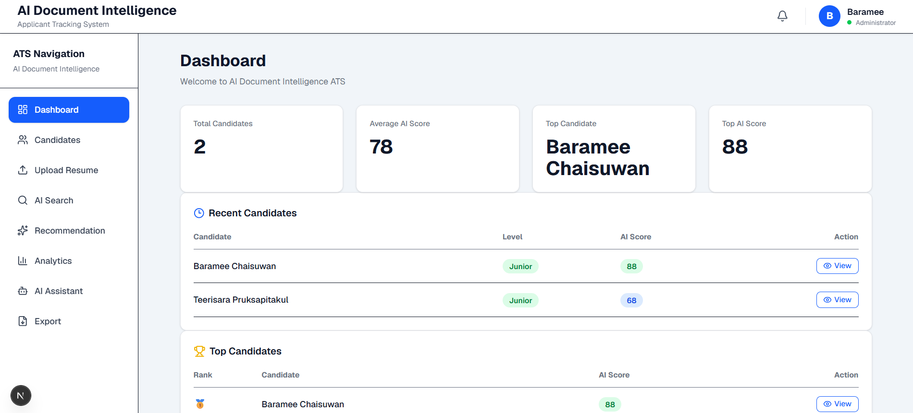

### Resume analysis
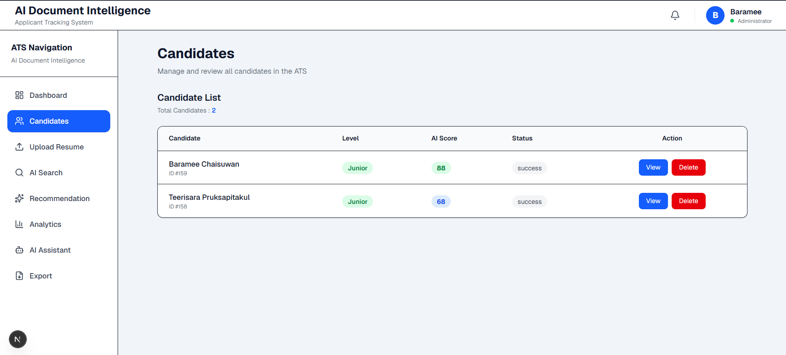

### AI assistant
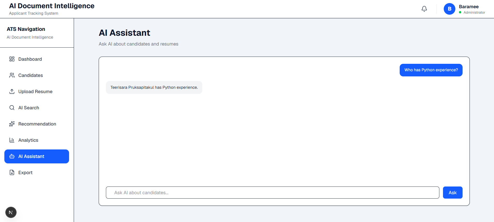

### Candidate recommendation
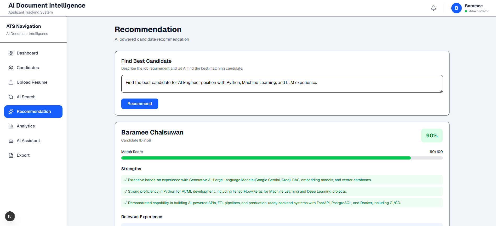

*Full screenshot set, including API responses, is in the [Screenshots](#screenshots) section below.*

## Project highlights

- **AI Resume Intelligence Pipeline** — PDF ingestion, text extraction,
  Gemini-based structured extraction, deterministic + AI-assisted candidate
  scoring, and embedding generation, all committed atomically so a candidate
  is never left partially indexed.
- **RAG HR Assistant** — a recruiter asks a natural-language question, the
  system retrieves the most relevant resume evidence via hybrid search, and
  Gemini generates an answer grounded in that retrieved evidence, with a
  no-information fallback when nothing relevant is found.
- **Candidate Recommendation** — given a job requirement, the system runs
  hybrid retrieval across the candidate pool, ranks candidates, and returns a
  structured, evidence-based recommendation — Gemini's suggested candidate is
  rejected if it isn't actually part of the retrieved set.
- **Hybrid retrieval architecture** — pgvector similarity search fused with
  PostgreSQL-backed BM25 via Reciprocal Rank Fusion, so retrieval captures
  both semantic meaning and exact keyword matches.
- **JWT authentication with RBAC** — bcrypt password hashing and role-based
  access control (`admin` / `recruiter`) enforced on the backend and mirrored
  in the frontend.
- **Cloud-native deployment** — Google Cloud Run, Cloud SQL (PostgreSQL +
  pgvector), Cloud Storage, and Artifact Registry, deployed through an
  automated GitHub Actions pipeline.
- **Automated testing** — a backend test suite covering auth, RBAC, scoring,
  hybrid retrieval, RAG, and export, run in CI against a real
  pgvector-enabled PostgreSQL instance.
- **Full-featured frontend** — Next.js dashboard, analytics, candidate
  search, upload, AI assistant, recommendation, and admin-only export
  workflows.

## User workflow

**Recruiter journey, end to end:**

1. Recruiter uploads a resume PDF.
2. Gemini extracts structured candidate information (skills, experience,
   education, projects) from the raw text.
3. The system evaluates skills with a rule-based score, refined by an
   AI-assisted score.
4. The resume is chunked, embedded, and indexed alongside the candidate
   record — durably, in the same database transaction.
5. Recruiter searches candidates semantically, or filters/ranks them by
   score and level.
6. Recruiter asks the AI assistant a free-form question ("who has production
   Kubernetes experience?") and gets an answer grounded in retrieved resume
   evidence.
7. Recruiter (or the system, on request) generates a structured
   recommendation for a specific job requirement, backed by the same
   retrieval pipeline.

## Architecture

```text
                                Gemini 2.5 Flash API
                                        ^
                                        |
User
  |
  v
Next.js Frontend  (App Router, React, TypeScript) (Vercel)
  |
  | HTTP/JSON + Bearer JWT
  v
FastAPI Backend
  |
  v
Service Layer        (business logic, AI orchestration, scoring, RAG)
  |
  v
Repository Layer      (SQLAlchemy data access)
  |
  +------------------------+
  |                        |
  v                        v
Google Cloud Storage    PostgreSQL + pgvector
(private resume PDFs)   (candidates, users, resume chunks, embeddings)
```

The service layer calls out to **Gemini 2.5 Flash** for extraction and
generation, **PyMuPDF** for PDF text extraction, and **SentenceTransformer**
(`paraphrase-MiniLM-L3-v2`) for embeddings. The repository layer then fans
out to two durable stores: the original PDF goes to **Google Cloud Storage**,
while structured candidate data, resume chunks, and embeddings go to
**PostgreSQL + pgvector**. GCS and PostgreSQL are separate systems, so the
two writes are not covered by a single distributed transaction; consistency
between them is maintained through compensating actions rather than atomic
commit (see the resume upload flow below).

### Resume upload flow

```text
PDF upload
  -> Validation (filename, signature, size)
  -> Text extraction (PyMuPDF)
  -> Gemini structured extraction (skills, experience, education, projects)
  -> Rule-based + AI-assisted candidate scoring
  -> Candidate row committed to PostgreSQL
  -> PDF stored privately in Google Cloud Storage
  -> Text chunking + embedding generation
  -> Chunks and embeddings committed to PostgreSQL/pgvector
```

Candidate metadata and resume chunks are written in a single transaction. If
embedding or indexing fails, the transaction is rolled back and the uploaded
file is deleted from Cloud Storage as compensation — the system never leaves
a candidate without a searchable index or an orphaned file behind.

### RAG flow

```text
User query
  -> Query embedding (SentenceTransformer)
  -> Vector search (pgvector cosine distance)
  -> BM25 keyword search (reconstructed from PostgreSQL)
  -> Hybrid ranking (Reciprocal Rank Fusion, RRF_K = 60)
  -> Bounded context assembly from top chunks
  -> Gemini response generation (assistant answer or structured recommendation)
```

The assistant returns a no-information response when retrieval finds no
relevant evidence, and structured recommendations are rejected unless the
recommended candidate ID belongs to the retrieved candidate set — both are
guardrails against the model hallucinating candidates that aren't backed by
retrieved evidence.

## Data model

The schema centers on three tables:

- **User** — an authenticated account (`admin` or `recruiter`), with a
  bcrypt-hashed password and the role used for RBAC enforcement.
- **Candidate** — a structured record produced from one uploaded resume:
  parsed contact info, skills, experience, education, projects, the
  rule-based and AI-assisted scores, and a reference to the stored PDF in
  Google Cloud Storage.
- **ResumeChunk** — one chunk of a candidate's resume text, together with
  its embedding vector, used for hybrid (vector + BM25) retrieval.

**Relationship**: a `Candidate` has many `ResumeChunk` rows (one-to-many,
`ResumeChunk.candidate_id -> Candidate.id`), reflecting the fact that a
resume is split into multiple chunks at indexing time. Deleting a candidate
cascades to its chunks so retrieval never returns orphaned embeddings.
`User` is not directly related to `Candidate` or `ResumeChunk` in the
schema — recruiters and admins act on the shared candidate pool rather than
owning individual candidates.

## Backend architecture

| Folder | Responsibility |
| --- | --- |
| `app/api/` | HTTP endpoints, request/response mapping, auth dependencies |
| `app/services/` | Business logic and the AI processing pipeline (parsing, scoring, RAG orchestration) |
| `app/repositories/` | Database access abstraction over SQLAlchemy |
| `app/database/` | SQLAlchemy models, engine, and session management |
| `app/models/` | Pydantic request/response schemas |
| `app/rag/` | Prompting, text chunking, retrieval context assembly, evaluation helpers |
| `app/vector/` | pgvector similarity search, BM25 reconstruction, hybrid ranking |
| `alembic/` | PostgreSQL schema migrations |
| `scripts/` | Administrative CLI tools (e.g. bootstrapping the first admin) |
| `tests/` | Pytest suite |

### Frontend

Next.js 16 (App Router) with React 19 and TypeScript. Pages live in
`frontend/app`, typed API calls in `frontend/services`, and auth state is
provided at the root layout via `AuthProvider` / `AuthGate`. Key routes cover
login/register, dashboard, candidate list/detail, upload, semantic search, the
RAG assistant, recommendations, and admin-only CSV export.

## AI engineering

### LLM integration

- Gemini 2.5 Flash extracts normalized candidate data (name, skills, languages,
  education, experience, projects) as structured JSON from raw resume text.
- Gemini generates a short candidate summary and an AI assessment score,
  used alongside a deterministic rule-based score.
- Structured output generation is used for candidate recommendation: Gemini
  returns a typed Pydantic response, not free text, and the response is
  validated against the actual retrieved candidate set before being trusted.

### Retrieval-augmented generation

- **Embedding creation**: resume text is chunked with a recursive character
  splitter and embedded with SentenceTransformer into normalized
  384-dimensional vectors.
- **Vector similarity search**: pgvector performs cosine-distance search
  directly in PostgreSQL — no separate vector database to operate.
- **BM25 keyword retrieval**: a `rank_bm25` corpus is reconstructed from
  current PostgreSQL chunk rows on every query, so it's always consistent
  with the live database — no stale on-disk index.
- **Hybrid retrieval**: vector and BM25 rankings are fused with equal-weight
  Reciprocal Rank Fusion (`RRF_K = 60`) before context is handed to Gemini.

### Data pipeline

- **PDF processing**: PyMuPDF extracts text per page; image-only PDFs with no
  extractable text are rejected at upload time.
- **Text chunking**: recursive character splitting with configurable chunk
  size and overlap (`RAG_CHUNK_SIZE`, `RAG_CHUNK_OVERLAP`).
- **Embedding storage**: chunks and embeddings are persisted in PostgreSQL as
  the single durable source of truth for retrieval — shared across all
  application instances, so horizontal scaling and Cloud Run restarts don't
  lose RAG data.
- **Candidate knowledge retrieval**: the same indexed chunks back three
  surfaces — semantic search, the RAG assistant, and structured
  recommendation — rather than three separate pipelines.

## API summary

| Method | Route | Purpose | Access |
| --- | --- | --- | --- |
| `GET` | `/health/` | Health check | Public |
| `POST` | `/auth/register` | Create recruiter account | Public |
| `POST` | `/auth/login` | Issue JWT access token | Public |
| `GET` | `/auth/me` | Current authenticated user | Authenticated |
| `GET` | `/candidates/` | Paginated candidate list | Authenticated |
| `GET` | `/candidates/search` | Filter by name, level, minimum AI score | Staff |
| `GET` | `/candidates/stats` | Count and average AI score | Authenticated |
| `GET` | `/candidates/ranking` | Candidates ranked by AI score | Authenticated |
| `GET` | `/candidates/{id}` | Candidate detail | Authenticated |
| `PUT` | `/candidates/{id}` | Update candidate level / score | Admin |
| `DELETE` | `/candidates/{id}` | Delete candidate and its indexes | Admin |
| `POST` | `/upload/` | Ingest and index a PDF resume | Staff |
| `POST` | `/search/` | Semantic candidate search | Staff |
| `POST` | `/assistant/` | Ask the RAG assistant | Staff |
| `POST` | `/recommend/` | Recommend a candidate for a job requirement | Staff |
| `GET` | `/dashboard/*` | Summary, top candidates, score/level distribution, recent candidates | Authenticated |
| `GET` | `/export/csv` | Download timestamped candidate CSV | Admin |

*Staff = `admin` or `recruiter`.* Full request/response contracts are in the
interactive Swagger UI at `/docs`.

## Authentication and authorization

- Passwords are hashed with bcrypt (12 rounds); access tokens are signed
  HS256 JWTs with `sub`, `type`, `iat`, and `exp` claims. Refresh tokens and
  auth cookies are not implemented.
- Public registration always creates a `recruiter` — there is no public
  admin-registration endpoint. The first `admin` is created via an
  interactive CLI (see below).
- RBAC is enforced on the backend with FastAPI dependencies and mirrored in
  the frontend (e.g. recruiters don't see Export or Delete controls). The
  backend remains the authoritative security boundary in all cases.
- The frontend stores the access token in tab-scoped `sessionStorage`; a
  shared Axios interceptor attaches the bearer token and redirects to
  `/login` on any `401`.

## Cloud deployment

This project is deployed using a production-oriented cloud architecture:

- **Stateless backend services** — the FastAPI app holds no in-process state
  between requests, so it scales horizontally on Cloud Run without sticky
  sessions.
- **Managed PostgreSQL database** — Cloud SQL handles backups, patching, and
  availability instead of a self-managed database instance.
- **Durable vector storage** — candidate metadata and RAG chunks/embeddings
  live in the same PostgreSQL instance, so there's no separate vector store
  to keep in sync or lose on restart.
- **Containerized deployment** — the backend ships as a Docker image built
  from the same `Dockerfile` used locally and in CI.
- **Automated CI/CD** — every push is tested, and the backend is built and
  deployed, through GitHub Actions, while a separate frontend workflow
  lints and build-verifies the Next.js app on every push, removing manual
  deployment steps.

Backend:
- FastAPI deployed on Google Cloud Run
- Cloud Run URL: https://ats-api-355421066989.asia-southeast1.run.app
- Swagger UI: https://ats-api-355421066989.asia-southeast1.run.app/docs

Frontend:
- Next.js deployed on Vercel
- Live URL: https://ai-document-intelligence-9ut04o1zh-ats-resume-intelligence.vercel.app

```text
Developer
  -> GitHub repository
  -> GitHub Actions
       Backend CI/CD (.github/workflows/test.yml)
         -> Backend tests (pgvector-enabled PostgreSQL service)
         -> Alembic migration
         -> Docker build
         -> Push image to Artifact Registry
         -> Deploy to Cloud Run
         -> Health check
       Frontend CI (.github/workflows/frontend-ci.yml)
         -> npm ci
         -> ESLint
         -> Next.js production build
```

There are two independent GitHub Actions workflows. The backend workflow
(`test.yml`) runs the pytest suite against a real PostgreSQL + pgvector
service container, applies Alembic migrations, builds and pushes the Docker
image to Artifact Registry, deploys to Cloud Run, and runs a post-deploy
health check. The frontend workflow (`frontend-ci.yml`) installs
dependencies with `npm ci`, runs ESLint, and runs a production Next.js build
on every push, so frontend regressions are caught in CI before merge; the
frontend itself deploys separately through Vercel's own Git integration.

| Component | Role |
| --- | --- |
| Google Cloud Run | Serverless container hosting for the FastAPI backend |
| Google Artifact Registry | Docker image storage |
| Cloud SQL (PostgreSQL + pgvector) | Managed database and vector store |
| Google Cloud Storage (GCS) | Private resume PDF object storage |
| Vercel | Hosting and deployment for the Next.js frontend |
| GitHub Actions | Backend CI/CD (test, build, deploy) and frontend CI (lint, build) |

Vector search and BM25 both read from Cloud SQL as the shared source of
truth, so scaling to multiple Cloud Run instances doesn't fragment or lose
RAG data — there is no local index file or separate vector database to keep
in sync.

## Engineering decisions

**Why PostgreSQL + pgvector instead of a separate vector database?**
A dedicated vector database (Pinecone, Weaviate, Chroma, etc.) adds another
system to operate, secure, and keep consistent with the primary database.
Using pgvector keeps candidate metadata and embeddings in the same
PostgreSQL instance, in the same transaction — a candidate and its
embeddings either commit together or roll back together, with one
connection pool and one backup/restore story instead of two.

**Why hybrid search instead of vector-only?**
Vector search is strong at semantic meaning ("backend engineer" matching
"API developer") but can miss exact terms that matter a lot in recruiting —
specific tool names, certifications, or acronyms. BM25 is strong at exact
keyword matches but blind to paraphrasing. Fusing both with Reciprocal Rank
Fusion gets the benefits of each without picking one failure mode over the
other.

**Why RAG instead of letting the LLM answer from its own knowledge?**
An LLM asked "does this candidate know Kubernetes?" without grounding will
happily guess. Retrieval-augmented generation forces every answer to be
built from actually-retrieved resume text, which reduces hallucination,
keeps answers explainable (the evidence is traceable to specific chunks),
and lets the no-information path trigger honestly when there's no
supporting evidence instead of the model inventing one.

## Environment variables

Configuration is managed entirely through environment variables — copy
`.env.example` to `.env` and fill in real values locally; never commit a
populated `.env` file. In production, secrets (`DATABASE_URL`,
`GEMINI_API_KEY`, `JWT_SECRET_KEY`) are injected through the deployment
environment (e.g. Cloud Run environment configuration / Secret Manager),
not committed to the repository.

Required: `DATABASE_URL`, `GEMINI_API_KEY`, `JWT_SECRET_KEY` (minimum 32
bytes). Everything else — CORS origins, token lifetime, upload size limits,
embedding model, chunking parameters, database pool sizing — has a sensible
default and is documented inline in `.env.example`.

The frontend requires one public (non-secret) variable,
`NEXT_PUBLIC_API_URL`, in `frontend/.env.local`.

## Local development

### Prerequisites

- Python 3.13
- PostgreSQL 16 (or Docker for the provided database service)
- Node.js and npm compatible with Next.js 16
- A Gemini API key

### 1. Environment and database

```bash
cp .env.example .env
docker compose up -d db
```

### 2. Backend

```bash
python -m venv .venv
source .venv/bin/activate        
cd backend
pip install -r requirements.txt
alembic upgrade head
python -m uvicorn main:app --reload
```

API: `http://localhost:8000` · Swagger UI: `http://localhost:8000/docs`

### 3. Frontend

```bash
cd frontend
echo "NEXT_PUBLIC_API_URL=http://localhost:8000" > .env.local
npm install
npm run dev
```

Frontend: `http://localhost:3000`

### 4. Create the first administrator

Public registration only creates recruiters. Bootstrap the first admin via
the interactive CLI (prompts for email, name, and password; nothing is
printed to the terminal):

```bash
cd backend
python scripts/create_admin.py
```

### Docker (full backend stack)

```bash
docker compose up -d --build db api
docker compose exec api alembic upgrade head
```

The `docker-compose.yml` defines local `api` and `db` services for
development only; there is no frontend service in Compose — run it locally
or deploy it separately.

## Testing

Backend:

```bash
cd backend
pytest -q
```

The suite covers:

- **Unit-level logic**: rule-based scoring, chunking, RRF fusion
- **Integration tests**: authentication, real JWT/RBAC enforcement,
  candidate CRUD, upload orchestration, semantic and hybrid retrieval,
  assistant/recommendation behavior, CSV export, and the admin CLI
- **Database migration validation**: tests run against a real
  pgvector-enabled PostgreSQL instance with Alembic migrations applied,
  not a mocked database
- **CI verification**: every push runs the full suite in GitHub Actions
  against a fresh PostgreSQL + pgvector service container

The hybrid-search tests load the SentenceTransformer model, so the first
run may need network access to download it.

Frontend:

```bash
cd frontend
npm ci
npm run lint
npm run build
```

All three commands run automatically on every push via the frontend CI
workflow (`.github/workflows/frontend-ci.yml`), so lint and build
regressions are caught before merge, independently of the backend pipeline.

## Repository structure

```text
AI-Document-Intelligence/
├── backend/
│   ├── app/
│   │   ├── api/                # HTTP endpoints
│   │   ├── core/               # Config, security, exceptions
│   │   ├── database/           # SQLAlchemy models and engine
│   │   ├── models/             # Pydantic schemas
│   │   ├── repositories/       # Database access
│   │   ├── services/           # Business logic and AI pipeline
│   │   ├── rag/                # Prompting, chunking, retrieval
│   │   └── vector/             # pgvector, BM25, hybrid search
│   ├── alembic/                # Migrations
│   ├── scripts/                # Admin CLI
│   ├── tests/                  # Pytest suite
│   └── Dockerfile
│
├── frontend/
│   ├── app/                    # Next.js App Router pages
│   ├── components/             # Reusable UI components
│   ├── services/               # Typed API clients
│   ├── hooks/
│   ├── contexts/               # React context providers (auth state)
│   └── types/                  # Shared TypeScript types
│
├── .github/
│   └── workflows/
│       ├── test.yml            # Backend CI/CD
│       └── frontend-ci.yml     # Frontend CI
│
├── assets/
│   └── screenshots/            # Images referenced in this README
├── docker-compose.yml
└── README.md
```

## Promoting a user to admin

The system uses role-based access control (RBAC) with two roles:

- `admin` — full system access
- `recruiter` — candidate management and recruitment workflows

Public registration always creates a `recruiter` account (see
[Authentication and authorization](#authentication-and-authorization)), and
`scripts/create_admin.py` bootstraps a brand-new admin from scratch (see
[Create the first administrator](#4-create-the-first-administrator)). To
promote an *already-registered* user to admin instead, update their role
directly in PostgreSQL:

```sql
UPDATE users
SET role = 'admin'
WHERE email = 'your-email@example.com';
```

Example:

```sql
UPDATE users
SET role = 'admin'
WHERE email = 'admin@example.com';
```

The user must log in again afterward — the change takes effect on the next
issued JWT, not retroactively on tokens already in circulation.

**Local (Docker Postgres)**

```bash
docker exec -it resume_db psql -U postgres -d resume_db
```

Then run the `UPDATE` statement above at the `psql` prompt.

**Cloud SQL**

Connect via the Cloud SQL Auth Proxy or Cloud SQL Studio in the Google Cloud
Console, then run the same `UPDATE` statement against the production
database.

## Future improvements

- **Better RAG evaluation framework** — introduce systematic retrieval and
  answer-quality metrics to evaluate grounding accuracy, retrieval relevance,
  and assistant performance instead of relying on manual spot checks.

- **Async background processing** — move Gemini extraction, embedding generation,
  and indexing workloads into a background queue/worker architecture to reduce
  upload latency and improve scalability.

- **More advanced embedding models** — evaluate larger or domain-specific
  embedding models against the current `paraphrase-MiniLM-L3-v2` baseline to
  improve retrieval quality.

- **Production monitoring and observability** — integrate structured logging,
  distributed tracing, Cloud Logging, and AI pipeline monitoring to track
  extraction failures, retrieval quality, model latency, and system health.

- **Multi-tenant recruiter workspace** — support organization-based isolation
  with separate recruiter teams, users, and candidate pools instead of a
  single shared workspace.

- **Improved authentication security** — introduce refresh tokens and
  HttpOnly cookie-based authentication to replace browser storage tokens and
  improve resistance against token-related security risks.

## Screenshots

All images below already exist in `assets/screenshots`.

### Frontend

#### Dashboard


#### Candidate management


#### AI search

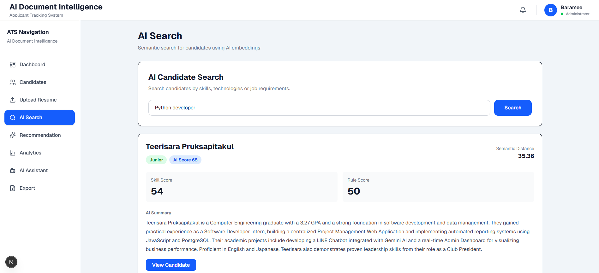

#### AI assistant


#### Candidate recommendation


#### Analytics

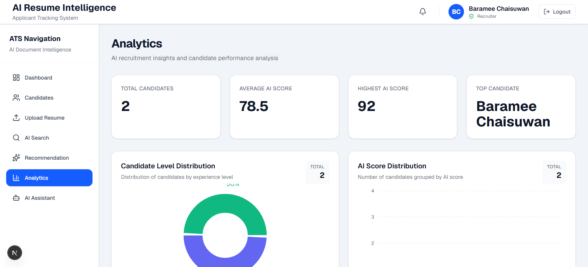

#### CSV export

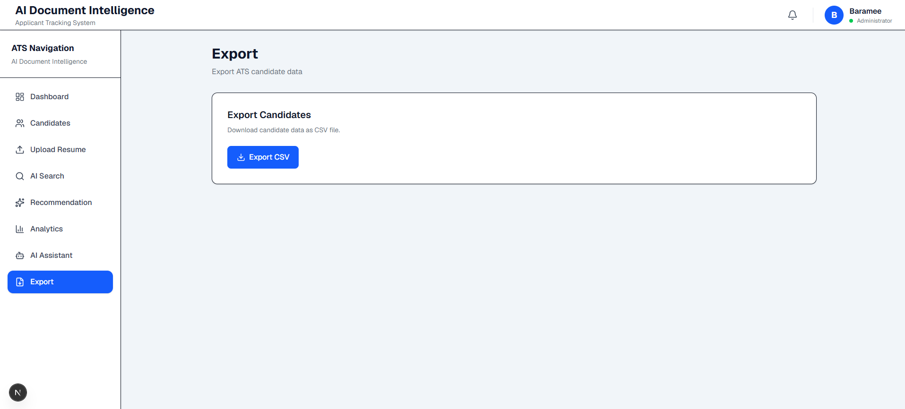

### API

#### Resume upload

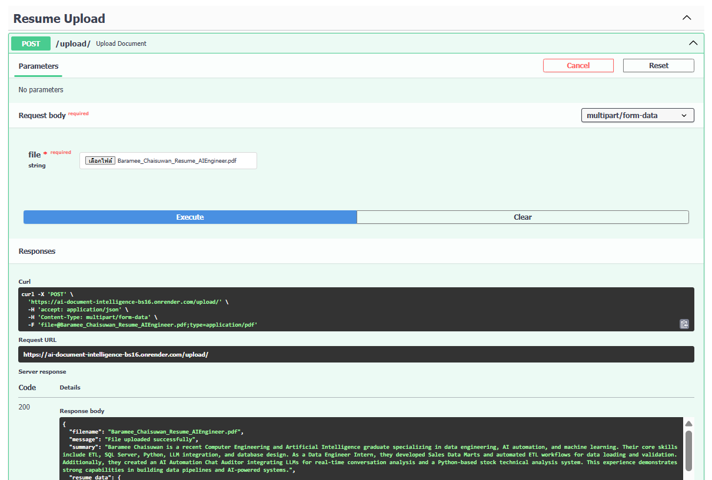

#### Candidate filtering and ranking

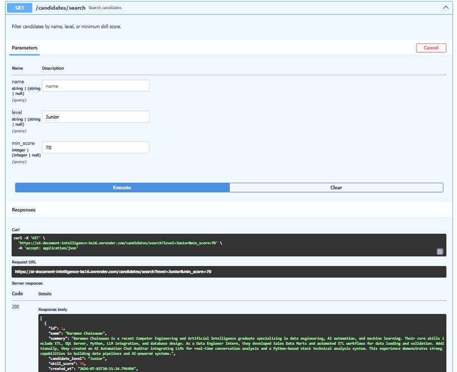

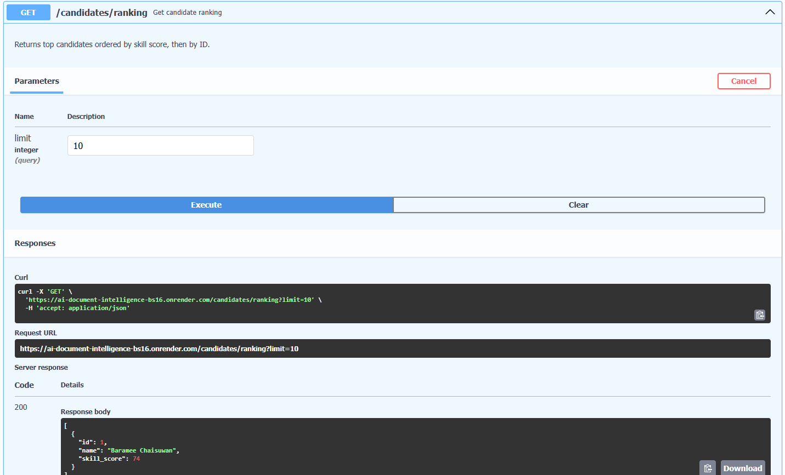

#### Semantic search

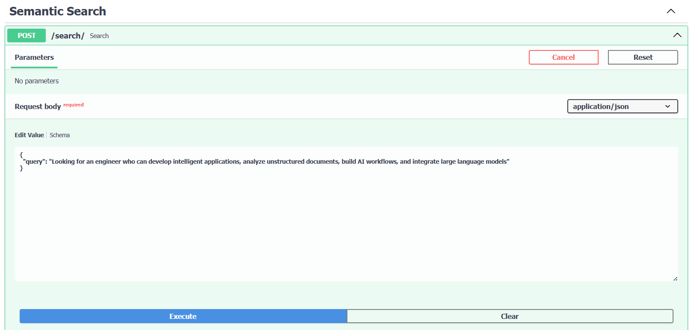

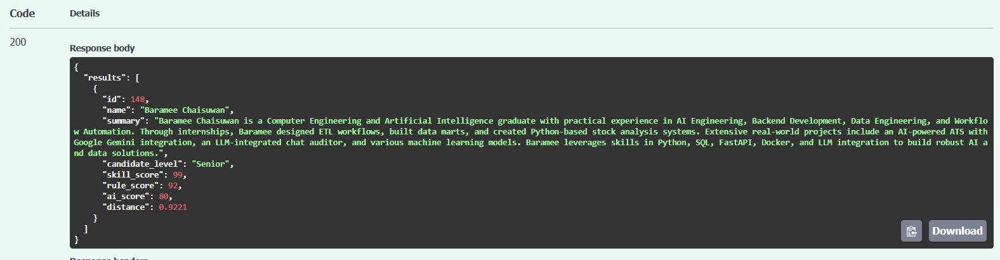

#### RAG assistant

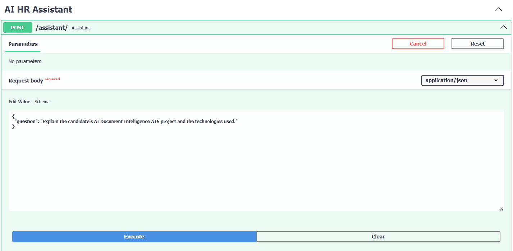

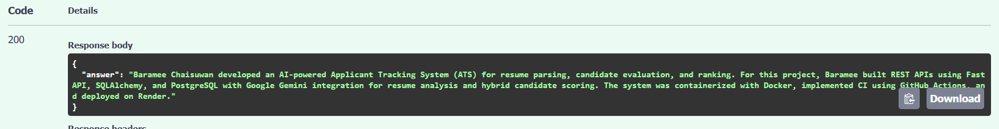

#### Recommendation

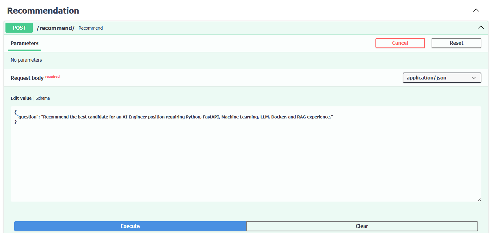

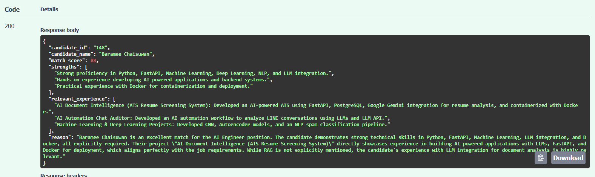

#### Dashboard and export

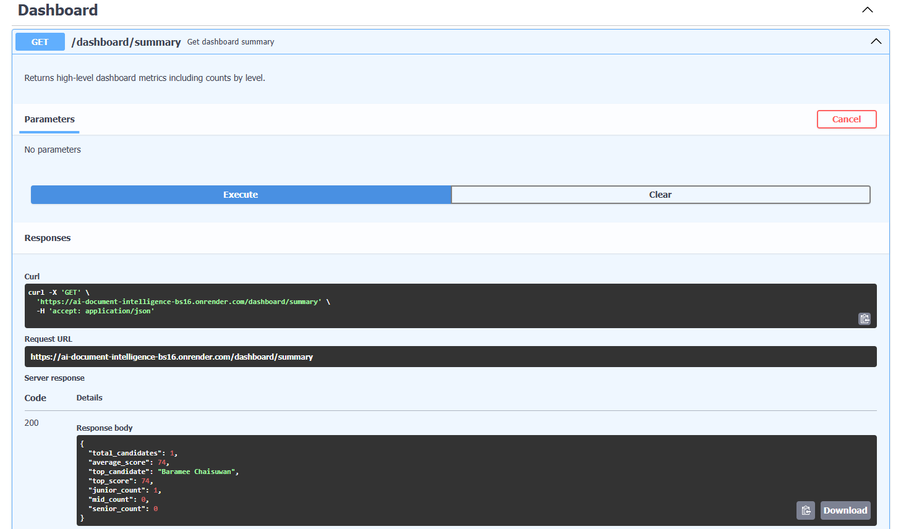

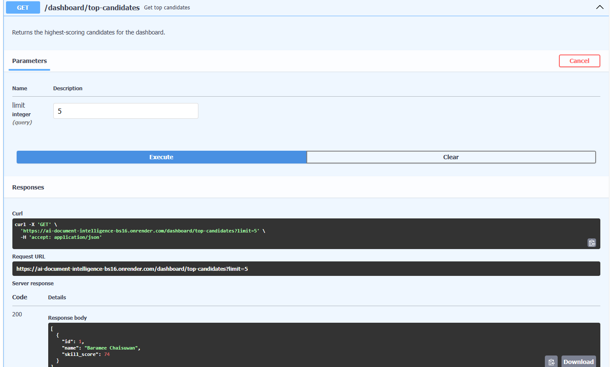

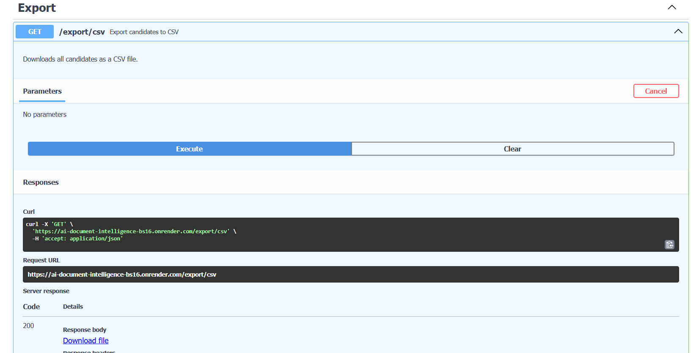
