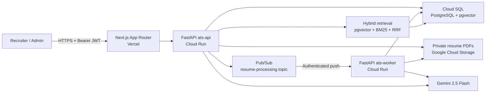
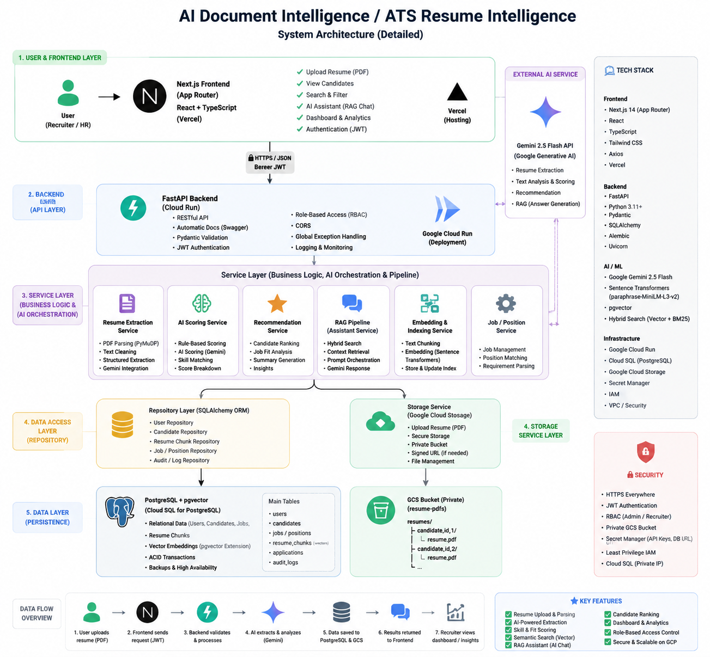
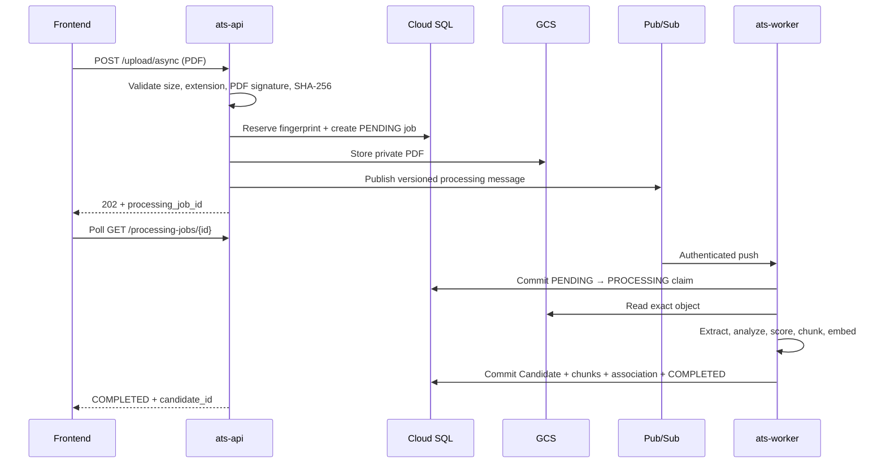

# AI Document Intelligence — ATS Resume Intelligence Platform

An AI-powered Applicant Tracking System that ingests PDF resumes, extracts structured
candidate data with an LLM, scores candidates against job criteria, and answers
recruiter questions through a retrieval-augmented HR assistant.

The system combines a FastAPI backend, a Next.js frontend, PostgreSQL with pgvector,
and Google Gemini 2.5 Flash to turn unstructured resumes into searchable, scored,
queryable candidate data — with hybrid (vector + keyword) retrieval powering both
semantic search and the RAG assistant.

## Links

- **Live Demo (Vercel)**  
  https://ai-document-intelligence-nu.vercel.app

- **Source Code (GitHub)**  
  https://github.com/baramee-chaisuwan/AI-Document-Intelligence

## Tech stack

**Backend**
- FastAPI
- SQLAlchemy
- PostgreSQL 16
- pgvector
- Alembic

**AI**
- Google Gemini 2.5 Flash
- SentenceTransformer
- RAG (Retrieval-Augmented Generation)
- Hybrid Search (Vector + BM25)

**Frontend**
- Next.js 16
- React 19
- TypeScript

**Infrastructure**
- Docker
- Google Cloud Run
- Cloud SQL PostgreSQL + pgvector
- Google Cloud Storage (GCS)
- Artifact Registry
- Vercel
- GitHub Actions

## Project overview

Recruiters spend a disproportionate amount of time manually reading resumes,
re-typing candidate details into spreadsheets, and re-reading the same PDFs to
answer a hiring manager's question. Most of that work is pattern extraction and
retrieval — exactly what LLMs, embeddings, and retrieval-augmented generation
are good at.

This project demonstrates a production-oriented AI recruitment workflow by combining structured extraction,
hybrid retrieval, and grounded generation, 
and every recommendation is validated against the actual
candidates retrieved before being returned.

- **Problem it solves**: unstructured resume PDFs are slow to search, hard to
  compare consistently, and expensive to re-read every time a new question
  comes up.
- **Why it was built**: as a hands-on exploration of production RAG
  architecture — structured extraction, hybrid retrieval, and grounded
  generation — applied to a domain (recruiting) where hallucination has real
  consequences.
- **Who it's for**: recruiters and hiring teams who need to triage, search,
  and compare candidates quickly; and, as a portfolio piece, engineers and
  technical recruiters evaluating applied AI engineering skill.
- **Value it provides**: minutes instead of hours to go from a stack of PDF
  resumes to a searchable, scored, queryable candidate pool — with answers
  that cite real resume content instead of plausible-sounding guesses.

## My role

Designed and implemented the full AI application stack, end to end:

- Backend API architecture (FastAPI, service/repository layering)
- LLM integration (Gemini structured extraction, scoring, RAG generation)
- RAG pipeline (chunking, embedding, retrieval, grounded generation)
- Hybrid retrieval system (pgvector + BM25, Reciprocal Rank Fusion)
- Database schema design (PostgreSQL + pgvector, Alembic migrations)
- Cloud deployment (Cloud Run, Cloud SQL, Cloud Storage)
- CI/CD pipeline (GitHub Actions)
- Frontend integration (Next.js consumption of the backend API)

## Application preview

### Dashboard


### Resume analysis


### AI assistant


### Candidate recommendation


*Full screenshot set, including API responses, is in the [Screenshots](#screenshots) section below.*

## Project highlights

- **AI Resume Intelligence Pipeline** — PDF ingestion, text extraction,
  Gemini-based structured extraction, deterministic + AI-assisted candidate
  scoring, and embedding generation, all committed atomically so a candidate
  is never left partially indexed.
- **RAG HR Assistant** — a recruiter asks a natural-language question, the
  system retrieves the most relevant resume evidence via hybrid search, and
  Gemini generates an answer grounded in that retrieved evidence, with a
  no-information fallback when nothing relevant is found.
- **Candidate Recommendation** — given a job requirement, the system runs
  hybrid retrieval across the candidate pool, ranks candidates, and returns a
  structured, evidence-based recommendation — Gemini's suggested candidate is
  rejected if it isn't actually part of the retrieved set.
- **Hybrid retrieval architecture** — pgvector similarity search fused with
  PostgreSQL-backed BM25 via Reciprocal Rank Fusion, so retrieval captures
  both semantic meaning and exact keyword matches.
- **JWT authentication with RBAC** — bcrypt password hashing and role-based
  access control (`admin` / `recruiter`) enforced on the backend and mirrored
  in the frontend.
- **Durable asynchronous processing** — uploads create a PostgreSQL processing
  job, store the private PDF in GCS, publish a versioned Pub/Sub message, and
  complete extraction and indexing in an authenticated Cloud Run worker.
- **Recruiter workflows** — job-description extraction and explainable
  candidate matching, plus an Applied → Screening → Interview → Offer / Rejected
  candidate pipeline.
- **Exact-file deduplication** — SHA-256 reservations prevent the same resume
  from being processed twice, including while its first upload is still active.
- **Observable and evaluable RAG** — structured Cloud Logging events, persisted
  retrieval/answer records, staff-entered quality feedback, and a reviewable
  monitoring setup for critical production signals.
- **Cloud-native deployment** — Google Cloud Run, Cloud SQL (PostgreSQL +
  pgvector), Cloud Storage, and Artifact Registry, deployed through an
  automated GitHub Actions pipeline.
- **Automated testing** — a backend test suite covering auth, RBAC, scoring,
  hybrid retrieval, RAG, and export, run in CI against a real
  pgvector-enabled PostgreSQL instance.
- **Full-featured frontend** — Next.js dashboard, analytics, candidate
  search, upload, AI assistant, recommendation, and admin-only export
  workflows.

## User workflow

**Recruiter journey, end to end:**

1. Recruiter uploads a resume PDF and receives a durable processing-job ID.
2. The API stores the file privately in GCS and publishes a versioned Pub/Sub
   message.
3. The authenticated worker claims the job and Gemini extracts candidate
   information (skills, experience,
   education, projects) from the raw text.
4. The system evaluates skills with a rule-based score, refined by an
   AI-assisted score.
5. Candidate data, resume chunks, embeddings, job association, and the final
   `COMPLETED` state commit together.
6. Recruiter searches candidates semantically, or filters/ranks them by
   score and level.
7. Recruiter asks the AI assistant a free-form question ("who has production
   Kubernetes experience?") and gets an answer grounded in retrieved resume
   evidence.
8. Recruiter creates a job, runs explainable candidate matching, and moves
   candidates through the hiring pipeline.

## Architecture


```mermaid
flowchart LR
    U["Recruiter / Admin"] -->|HTTPS + Bearer JWT| FE["Next.js App Router<br/>Vercel"]
    FE --> API["FastAPI ats-api<br/>Cloud Run"]
    API --> DB["Cloud SQL<br/>PostgreSQL + pgvector"]
    API --> GCS["Private resume PDFs<br/>Google Cloud Storage"]
    API --> PS["Pub/Sub<br/>resume-processing topic"]
    PS -->|Authenticated push| W["FastAPI ats-worker<br/>Cloud Run"]
    W --> GCS
    W --> DB
    W --> GEM["Gemini 2.5 Flash"]
    API --> GEM
    API --> RAG["Hybrid retrieval<br/>pgvector + BM25 + RRF"]
    RAG --> DB
```

## Architecture Diagram




The service layer calls out to **Gemini 2.5 Flash** for extraction and
generation, **PyMuPDF** for PDF text extraction, and **SentenceTransformer**
(`paraphrase-MiniLM-L3-v2`) for embeddings. The repository layer then fans
out to two durable stores: the original PDF goes to **Google Cloud Storage**,
while structured candidate data, resume chunks, and embeddings go to
**PostgreSQL + pgvector**. GCS and PostgreSQL are separate systems, so the
two writes are not covered by a single distributed transaction; consistency
between them is maintained through compensating actions rather than atomic
commit (see the resume upload flow below).

### Asynchronous resume-processing flow


```mermaid
sequenceDiagram
    participant F as Frontend
    participant A as ats-api
    participant D as Cloud SQL
    participant G as GCS
    participant P as Pub/Sub
    participant W as ats-worker

    F->>A: POST /upload/async (PDF)
    A->>A: Validate size, extension, PDF signature, SHA-256
    A->>D: Reserve fingerprint + create PENDING job
    A->>G: Store private PDF
    A->>P: Publish versioned processing message
    A-->>F: 202 + processing_job_id
    F->>A: Poll GET /processing-jobs/{id}
    P->>W: Authenticated push
    W->>D: Commit PENDING → PROCESSING claim
    W->>G: Read exact object
    W->>W: Extract, analyze, score, chunk, embed
    W->>D: Commit Candidate + chunks + association + COMPLETED
    A-->>F: COMPLETED + candidate_id
```

The fingerprint reservation returns HTTP `409` for an exact duplicate; when
the first copy is still processing, the response intentionally has no candidate
link yet. The worker commits its claim before expensive work, while Candidate,
ResumeChunk, processing-job association, and `COMPLETED` are committed together.
On processing failure those uncommitted records roll back and the durable job is
marked `FAILED`. GCS, Pub/Sub, and PostgreSQL do not share a distributed
transaction, so submission paths use explicit compensation where possible.

### RAG flow

```text
User query
  -> Query embedding (SentenceTransformer)
  -> Vector search (pgvector cosine distance)
  -> BM25 keyword search (reconstructed from PostgreSQL)
  -> Hybrid ranking (Reciprocal Rank Fusion, RRF_K = 60)
  -> Bounded context assembly from top chunks
  -> Gemini response generation (assistant answer or structured recommendation)
```

The assistant returns a no-information response when retrieval finds no
relevant evidence, and structured recommendations are rejected unless the
recommended candidate ID belongs to the retrieved candidate set — both are
guardrails against the model hallucinating candidates that aren't backed by
retrieved evidence.

Completed assistant and recommendation interactions also persist a minimized
evaluation record: query, generated answer, latency, operation, and retrieval
references without full resume chunks, names, emails, GCS keys, credentials, or
authorization data. Recruiters and admins can attach 1–5 retrieval/answer
ratings and a bounded optional note without exposing stored RAG content through
the feedback endpoint.

## Data model

The production schema includes:

- **User** — an authenticated account (`admin` or `recruiter`), with a
  bcrypt-hashed password and the role used for RBAC enforcement.
- **Candidate** — a structured record produced from one uploaded resume:
  parsed contact info, skills, experience, education, projects, the
  rule-based and AI-assisted scores, and a reference to the stored PDF in
  Google Cloud Storage.
- **ResumeChunk** — one chunk of a candidate's resume text, together with
  its embedding vector, used for hybrid (vector + BM25) retrieval.
- **Job** — recruiter-authored job text, Gemini-extracted structured
  requirements, and its matching embedding.
- **ResumeProcessingJob** — durable async status, timestamps, safe failure
  text, fingerprint reservation, and eventual Candidate association.
- **PasswordResetToken** — hashed OTP challenge state, failed attempts,
  verification, invalidation, and single-use consumption timestamps.
- **RAGEvaluation** — minimized RAG interaction metadata plus optional human
  retrieval/answer ratings and feedback.

**Relationship**: a `Candidate` has many `ResumeChunk` rows (one-to-many,
`ResumeChunk.candidate_id -> Candidate.id`), reflecting the fact that a
resume is split into multiple chunks at indexing time. Deleting a candidate
cascades to its chunks so retrieval never returns orphaned embeddings.
`User` is not directly related to `Candidate` or `ResumeChunk` in the
schema — recruiters and admins act on the shared candidate pool rather than
owning individual candidates.

## Backend architecture

| Folder | Responsibility |
| --- | --- |
| `app/api/` | HTTP endpoints, request/response mapping, auth dependencies |
| `app/services/` | Business logic and the AI processing pipeline (parsing, scoring, RAG orchestration) |
| `app/repositories/` | Database access abstraction over SQLAlchemy |
| `app/database/` | SQLAlchemy models, engine, and session management |
| `app/models/` | Pydantic request/response schemas |
| `app/rag/` | Prompting, text chunking, retrieval context assembly, evaluation helpers |
| `app/vector/` | pgvector similarity search, BM25 reconstruction, hybrid ranking |
| `alembic/` | PostgreSQL schema migrations |
| `scripts/` | Administrative CLI tools (e.g. bootstrapping the first admin) |
| `tests/` | Pytest suite |

### Frontend

Next.js 16 (App Router) with React 19 and TypeScript. Pages live in
`frontend/app`, typed API calls in `frontend/services`, and auth state is
provided at the root layout via `AuthProvider` / `AuthGate`. Key routes cover
login/register/password recovery, dashboard, candidate list/detail, async
upload progress, pipeline, job management/matching, semantic search, the RAG
assistant, recommendations, and admin-only CSV export.

## AI engineering

### LLM integration

- Gemini 2.5 Flash extracts normalized candidate data (name, skills, languages,
  education, experience, projects) as structured JSON from raw resume text.
- Gemini generates a short candidate summary and an AI assessment score,
  used alongside a deterministic rule-based score.
- Structured output generation is used for candidate recommendation: Gemini
  returns a typed Pydantic response, not free text, and the response is
  validated against the actual retrieved candidate set before being trusted.

### Retrieval-augmented generation

- **Embedding creation**: resume text is chunked with a recursive character
  splitter and embedded with SentenceTransformer into normalized
  384-dimensional vectors.
- **Vector similarity search**: pgvector performs cosine-distance search
  directly in PostgreSQL — no separate vector database to operate.
- **BM25 keyword retrieval**: a `rank_bm25` corpus is reconstructed from
  current PostgreSQL chunk rows on every query, so it's always consistent
  with the live database — no stale on-disk index.
- **Hybrid retrieval**: vector and BM25 rankings are fused with equal-weight
  Reciprocal Rank Fusion (`RRF_K = 60`) before context is handed to Gemini.

### Data pipeline

- **PDF processing**: PyMuPDF extracts text per page; image-only PDFs with no
  extractable text are rejected at upload time.
- **Text chunking**: recursive character splitting with configurable chunk
  size and overlap (`RAG_CHUNK_SIZE`, `RAG_CHUNK_OVERLAP`).
- **Embedding storage**: chunks and embeddings are persisted in PostgreSQL as
  the single durable source of truth for retrieval — shared across all
  application instances, so horizontal scaling and Cloud Run restarts don't
  lose RAG data.
- **Candidate knowledge retrieval**: the same indexed chunks back three
  surfaces — semantic search, the RAG assistant, and structured
  recommendation — rather than three separate pipelines.

## API summary

| Method | Route | Purpose | Access |
| --- | --- | --- | --- |
| `GET` | `/health/` | Health check | Public |
| `POST` | `/auth/register` | Create recruiter account | Public |
| `POST` | `/auth/login` | Issue JWT access token | Public |
| `POST` | `/auth/forgot-password` | Request a password-reset OTP | Public |
| `POST` | `/auth/verify-reset-otp` | Verify OTP and issue reset authorization | Public |
| `POST` | `/auth/reset-password` | Set a new password | Public |
| `GET` | `/auth/me` | Current authenticated user | Authenticated |
| `GET` | `/candidates/` | Paginated candidate list | Authenticated |
| `GET` | `/candidates/search` | Filter by name, level, minimum AI score | Staff |
| `GET` | `/candidates/stats` | Count and average AI score | Authenticated |
| `GET` | `/candidates/ranking` | Candidates ranked by AI score | Authenticated |
| `GET` | `/candidates/{id}` | Candidate detail | Authenticated |
| `PUT` | `/candidates/{id}` | Update candidate level / score | Admin |
| `DELETE` | `/candidates/{id}` | Delete candidate and its indexes | Admin |
| `POST` | `/upload/` | Ingest and index a PDF resume | Staff |
| `POST` | `/upload/async` | Queue durable asynchronous resume processing | Staff |
| `GET` | `/processing-jobs/{id}` | Read async processing status | Authenticated |
| `POST` | `/search/` | Semantic candidate search | Staff |
| `POST` | `/assistant/` | Ask the RAG assistant | Staff |
| `POST` | `/recommend/` | Recommend a candidate for a job requirement | Staff |
| `POST` | `/jobs` | Create and AI-prepare a job description | Staff |
| `GET` | `/jobs` | List jobs | Authenticated |
| `POST` | `/jobs/{id}/match` | Rank candidates for a job | Staff |
| `PUT` | `/candidates/{id}/stage` | Move a candidate through the pipeline | Staff |
| `PATCH` | `/rag-evaluations/{id}/feedback` | Add bounded human RAG ratings | Staff |
| `GET` | `/dashboard/*` | Summary, top candidates, score/level distribution, recent candidates | Authenticated |
| `GET` | `/export/csv` | Download timestamped candidate CSV | Admin |

*Staff = `admin` or `recruiter`.* Full request/response contracts are in the
interactive Swagger UI at `/docs`.

## Authentication and authorization

- Passwords are hashed with bcrypt (12 rounds); access tokens are signed
  HS256 JWTs with `sub`, `type`, `iat`, `exp`, and token-version claims.
  Refresh tokens and auth cookies are not implemented.
- Public registration always creates a `recruiter` — there is no public
  admin-registration endpoint. The first `admin` is created via an
  interactive CLI (see below).
- RBAC is enforced on the backend with FastAPI dependencies and mirrored in
  the frontend (e.g. recruiters don't see Export or Delete controls). The
  backend remains the authoritative security boundary in all cases.
- The frontend stores the access token in tab-scoped `sessionStorage`; a
  shared Axios interceptor attaches the bearer token and redirects to
  `/login` on any `401`.
- Password recovery uses a six-digit, bcrypt-hashed, single-use OTP that
  expires after 10 minutes. Verification is limited to five failed attempts,
  and a maximum of three codes may be requested per account in a 15-minute
  database-backed window. Forgot-password responses do not reveal whether an
  account exists.
- Successful OTP verification issues a separate short-lived
  `password_reset` JWT tied to one challenge. Resetting the password consumes
  that challenge and increments the user's token version, immediately
  invalidating access tokens issued before the password change.
- The worker receiver is intentionally an internal trust boundary: it has no
  browser authentication flow and must remain ingress-restricted with Cloud
  Run IAM authenticated invocation from the Pub/Sub push identity.

## Job matching and candidate pipeline

Recruiters and admins create job descriptions through `/jobs`. Gemini extracts
required skills, preferred skills, experience requirements, and responsibilities;
the job text is embedded once and stored with the Job. `/jobs/{id}/match` ranks
only candidates with durable resume chunks using the backend's fixed semantic,
required-skill, and preferred-skill formula. The frontend displays the returned
order and score breakdown without recalculating it.

Every Candidate defaults to `APPLIED` and can move through `SCREENING`,
`INTERVIEW`, `OFFER`, or `REJECTED`. The `/pipeline` page uses the existing
candidate list and stage-update API; it currently shows the first 50 candidates
and reports this limit in the UI.

## Cloud deployment

This project is deployed using a production-oriented cloud architecture:

- **Separated API and worker services** — `ats-api` serves public application
  traffic while ingress-restricted `ats-worker` receives authenticated Pub/Sub
  pushes. Both use the same backend image.
- **Managed PostgreSQL database** — Cloud SQL handles backups, patching, and
  availability instead of a self-managed database instance.
- **Durable vector storage** — candidate metadata and RAG chunks/embeddings
  live in the same PostgreSQL instance, so there's no separate vector store
  to keep in sync or lose on restart.
- **Containerized deployment** — the backend ships as a Docker image built
  from the same `Dockerfile` used locally and in CI.
- **Automated CI/CD** — GitHub Actions tests the backend against pgvector,
  builds and pushes one immutable commit-SHA image, applies committed Alembic
  migrations through the Cloud SQL Auth Proxy, deploys that image to `ats-api`
  and `ats-worker`, verifies image parity, and then health-checks the API.

Backend:
- FastAPI API and worker deployed as separate Google Cloud Run services
- Swagger UI is served from `/docs` on the deployed API service

Frontend:
- Next.js deployed on Vercel
- Live URL: https://ai-document-intelligence-nu.vercel.app

```text
Developer
  -> GitHub repository
  -> GitHub Actions
       Backend CI/CD (.github/workflows/test.yml)
         -> Backend tests (pgvector-enabled PostgreSQL service)
         -> Build and push one immutable SHA-tagged image
         -> Production Alembic migration via Cloud SQL Auth Proxy
         -> Deploy same image to ats-api
         -> Deploy same image to ats-worker
         -> Verify API/worker images match
         -> API health check
       Frontend CI (.github/workflows/frontend-ci.yml)
         -> npm ci
         -> ESLint
         -> Next.js production build
```

There are two independent GitHub Actions workflows. The backend workflow
(`test.yml`) runs the pytest suite against a real PostgreSQL + pgvector
service container, builds and pushes the Docker image before touching the
production database, applies Alembic migrations, and deploys the same exact
commit-SHA image to both Cloud Run services. A parity check fails deployment
if their image references diverge, preventing API/worker version skew. The
frontend workflow (`frontend-ci.yml`) installs
dependencies with `npm ci`, runs ESLint, and runs a production Next.js build
on every push, so frontend regressions are caught in CI before merge; the
frontend itself deploys separately through Vercel's own Git integration.

| Component | Role |
| --- | --- |
| Google Cloud Run | Separate `ats-api` and authenticated `ats-worker` services |
| Google Artifact Registry | Docker image storage |
| Cloud SQL (PostgreSQL + pgvector) | Managed database and vector store |
| Google Cloud Storage (GCS) | Private resume PDF object storage |
| Vercel | Hosting and deployment for the Next.js frontend |
| GitHub Actions | Backend CI/CD (test, build, deploy) and frontend CI (lint, build) |

Vector search and BM25 both read from Cloud SQL as the shared source of
truth, so scaling to multiple Cloud Run instances doesn't fragment or lose
RAG data — there is no local index file or separate vector database to keep
in sync.

## Engineering decisions

**Why PostgreSQL + pgvector instead of a separate vector database?**
A dedicated vector database (Pinecone, Weaviate, Chroma, etc.) adds another
system to operate, secure, and keep consistent with the primary database.
Using pgvector keeps candidate metadata and embeddings in the same
PostgreSQL instance, in the same transaction — a candidate and its
embeddings either commit together or roll back together, with one
connection pool and one backup/restore story instead of two.

**Why hybrid search instead of vector-only?**
Vector search is strong at semantic meaning ("backend engineer" matching
"API developer") but can miss exact terms that matter a lot in recruiting —
specific tool names, certifications, or acronyms. BM25 is strong at exact
keyword matches but blind to paraphrasing. Fusing both with Reciprocal Rank
Fusion gets the benefits of each without picking one failure mode over the
other.

**Why RAG instead of letting the LLM answer from its own knowledge?**
An LLM asked "does this candidate know Kubernetes?" without grounding will
happily guess. Retrieval-augmented generation forces every answer to be
built from actually-retrieved resume text, which reduces hallucination,
keeps answers explainable (the evidence is traceable to specific chunks),
and lets the no-information path trigger honestly when there's no
supporting evidence instead of the model inventing one.

## Security considerations

- Backend RBAC—not hidden frontend controls—is authoritative. Public signup
  always creates a recruiter; administrators are created only with the
  interactive bootstrap CLI.
- Access and password-reset JWTs are signed with an environment-specific
  secret of at least 32 UTF-8 bytes. Password changes increment token version,
  invalidating previously issued access tokens.
- OTPs are bcrypt-hashed, rate-limited, attempt-limited, expiring, and
  single-use. Public forgot-password responses resist account enumeration.
- Resume uploads are bounded by size, `.pdf` filename, non-empty content, and
  the PDF file signature before processing. Stored objects remain private.
- Cloud Run uses service-account identity through Application Default
  Credentials; credentials are never embedded in images or repository files.
- CORS must list the exact deployed frontend origins. The internal worker must
  remain ingress-restricted and require authenticated Pub/Sub invocation.
- Structured logs contain stable IDs, operation names, outcomes, latency, and
  error categories—not resume text, tokens, passwords, provider payloads, or
  credentials.
- RAG evaluation deliberately stores user queries and generated answers but
  strips full chunks and sensitive retrieval metadata. Production retention
  and access policies must reflect that queries/answers can still contain PII.
- The frontend uses tab-scoped `sessionStorage` because the current backend
  returns bearer tokens in JSON. This limits persistence but is still exposed
  to successful same-origin XSS; a future cookie-based design would require a
  coordinated backend authentication change.

## Observability and RAG evaluation

Structured JSON events cover HTTP requests, Pub/Sub publication and delivery,
worker state, Gemini/RAG operations, latency, outcomes, and safe error
categories. Payloads and credentials are intentionally excluded. Assistant and
recommendation interactions are persisted with minimized retrieval references,
and staff can attach bounded 1–5 retrieval and answer ratings.

The dry-run-first `infrastructure/scripts/setup-monitoring.ps1` defines five
Cloud Logging metrics and alert policies for worker requests, Pub/Sub
publication, RAG/Gemini operations, API latency, and resume processing. Applying
it requires both `-Apply` and an exact project confirmation; notification
channels and potential Cloud Monitoring costs should be reviewed first.

## Environment variables

Configuration is managed entirely through environment variables — copy
`.env.example` to `.env` and fill in real values locally; never commit a
populated `.env` file. In production, secrets (`DATABASE_URL`,
`GEMINI_API_KEY`, `JWT_SECRET_KEY`, `SMTP_PASSWORD`) are injected through the deployment
environment (e.g. Cloud Run environment configuration / Secret Manager),
not committed to the repository.

Required: `DATABASE_URL`, `GEMINI_API_KEY`, `JWT_SECRET_KEY` (minimum 32
bytes). Everything else — CORS origins, token lifetime, upload size limits,
embedding model, chunking parameters, database pool sizing — has a sensible
default and is documented inline in `.env.example`.

Password-recovery email uses `EMAIL_BACKEND=console` for local development;
the OTP is written only to the local backend log in that mode. Production
must use `EMAIL_BACKEND=smtp` and configure `SMTP_HOST`, `SMTP_PORT`,
`SMTP_FROM_EMAIL`, TLS settings, and provider credentials when required.
Console delivery is rejected when `ENVIRONMENT=production`, and raw provider
errors are never returned by the public API.

The frontend requires one public (non-secret) variable,
`NEXT_PUBLIC_API_URL`, in `frontend/.env.local`.

Variable names currently recognized by the application:

| Area | Names |
| --- | --- |
| Core | `DATABASE_URL`, `GEMINI_API_KEY`, `JWT_SECRET_KEY`, `ENVIRONMENT`, `APP_NAME`, `APP_VERSION`, `PORT` |
| Database | `DATABASE_MAX_RETRIES`, `DATABASE_RETRY_DELAY_SECONDS`, `DATABASE_POOL_SIZE`, `DATABASE_MAX_OVERFLOW` |
| Auth | `JWT_ALGORITHM`, `ACCESS_TOKEN_EXPIRE_MINUTES` |
| Password reset | `PASSWORD_RESET_OTP_EXPIRE_MINUTES`, `PASSWORD_RESET_TOKEN_EXPIRE_MINUTES`, `PASSWORD_RESET_MAX_ATTEMPTS`, `PASSWORD_RESET_REQUEST_LIMIT`, `PASSWORD_RESET_REQUEST_WINDOW_MINUTES` |
| Email | `EMAIL_BACKEND`, `SMTP_HOST`, `SMTP_PORT`, `SMTP_USERNAME`, `SMTP_PASSWORD`, `SMTP_FROM_EMAIL`, `SMTP_USE_TLS`, `SMTP_TIMEOUT_SECONDS` |
| Upload/storage | `MAX_UPLOAD_SIZE_MB`, `GCS_BUCKET_NAME`, `GCS_KEY_PREFIX` |
| Async messaging | `GCP_PROJECT_ID`, `PUBSUB_RESUME_PROCESSING_TOPIC` |
| Retrieval | `EMBEDDING_MODEL_NAME`, `EMBEDDING_BATCH_SIZE`, `RAG_CHUNK_SIZE`, `RAG_CHUNK_OVERLAP` |
| Web | `CORS_ORIGINS`, `NEXT_PUBLIC_API_URL` |

AWS keys and long-lived GCP service-account keys are not application
configuration. Cloud Run uses attached service accounts and Application
Default Credentials for GCS and Pub/Sub.

## Local development

### Prerequisites

- Python 3.13
- PostgreSQL 16 (or Docker for the provided database service)
- Node.js and npm compatible with Next.js 16
- A Gemini API key

### 1. Environment and database

```bash
cp .env.example .env
docker compose up -d db
```

### 2. Backend

```bash
python -m venv .venv
# Linux/macOS: source .venv/bin/activate
# Windows PowerShell: .\.venv\Scripts\Activate.ps1
cd backend
pip install -r requirements.txt
python -m alembic upgrade head
python -m uvicorn main:app --reload
```

API: `http://localhost:8000` · Swagger UI: `http://localhost:8000/docs`

With the default development email backend, request a reset from
`/forgot-password` and read the one-time code from the local backend console.
Use an SMTP sandbox instead if local email delivery needs to be tested end to
end; never place real SMTP credentials in `.env.example`.

### 3. Frontend

```bash
cd frontend
echo "NEXT_PUBLIC_API_URL=http://localhost:8000" > .env.local
npm install
npm run dev
```

Frontend: `http://localhost:3000`

### 4. Create the first administrator

Public registration only creates recruiters. Bootstrap the first admin via
the interactive CLI (prompts for email, name, and password; nothing is
printed to the terminal):

```bash
cd backend
python scripts/create_admin.py
```

### Docker (full backend stack)

```bash
docker compose up -d --build db api
docker compose exec api python -m alembic upgrade head
```

The `docker-compose.yml` defines local `api` and `db` services for
development only; there is no frontend service in Compose — run it locally
or deploy it separately.

## Testing

Backend:

```bash
cd backend
pytest -q
```

The suite covers:

- **Unit-level logic**: rule-based scoring, chunking, RRF fusion
- **Integration tests**: authentication, real JWT/RBAC enforcement,
  password-reset OTP lifecycle and token invalidation,
  candidate CRUD, upload orchestration, semantic and hybrid retrieval,
  assistant/recommendation behavior, CSV export, and the admin CLI
- **Database migration validation**: tests run against a real
  pgvector-enabled PostgreSQL instance with Alembic migrations applied,
  not a mocked database
- **CI verification**: every push runs the full suite in GitHub Actions
  against a fresh PostgreSQL + pgvector service container

The hybrid-search tests load the SentenceTransformer model, so the first
run may need network access to download it.

Frontend:

```bash
cd frontend
npm ci
npm run lint
npm run build
```

All three commands run automatically on every push via the frontend CI
workflow (`.github/workflows/frontend-ci.yml`), so lint and build
regressions are caught before merge, independently of the backend pipeline.

## Repository structure

```text
AI-Document-Intelligence/
├── backend/
│   ├── app/
│   │   ├── api/                # HTTP endpoints
│   │   ├── core/               # Config, security, exceptions
│   │   ├── database/           # SQLAlchemy models and engine
│   │   ├── models/             # Pydantic schemas
│   │   ├── repositories/       # Database access
│   │   ├── services/           # Business logic and AI pipeline
│   │   ├── rag/                # Prompting, chunking, retrieval
│   │   └── vector/             # pgvector, BM25, hybrid search
│   ├── alembic/                # Migrations
│   ├── scripts/                # API/worker entry points and admin CLI
│   ├── tests/                  # Pytest suite
│   ├── main.py                 # Public API application
│   ├── worker_main.py          # Internal Pub/Sub worker application
│   └── Dockerfile
│
├── frontend/
│   ├── app/                    # Next.js App Router pages
│   ├── components/             # Reusable UI components
│   ├── services/               # Typed API clients
│   ├── contexts/               # React context providers (auth state)
│   ├── lib/                    # Browser auth/recovery state helpers
│   └── types/                  # Shared TypeScript types
│
├── .github/
│   └── workflows/
│       ├── test.yml            # Backend CI/CD
│       └── frontend-ci.yml     # Frontend CI
│
├── assets/
│   └── screenshots/            # Images referenced in this README
├── infrastructure/
│   └── scripts/                # Explicit, dry-run-first operations scripts
├── docker-compose.yml
└── README.md
```

## Production checklist

- [ ] Apply committed migrations with `python -m alembic upgrade head`; verify
  the reported revision matches the repository's single Alembic head.
- [ ] Confirm Cloud SQL uses PostgreSQL with the `vector` extension, private or
  controlled connectivity, backups, and an application-scoped database user.
- [ ] Confirm the GCS resume bucket is private and both API/worker service
  accounts have only their required object permissions.
- [ ] Confirm the Pub/Sub topic and authenticated push subscription target the
  internal worker endpoint.
- [ ] Confirm `ats-worker` requires authenticated invocation, uses internal
  ingress, and runs with concurrency/max-instance limits appropriate for the
  embedding workload.
- [ ] Confirm `ats-api` and `ats-worker` report the same immutable image SHA.
- [ ] Inject `DATABASE_URL`, `GEMINI_API_KEY`, `JWT_SECRET_KEY`, and SMTP
  credentials from managed secrets; never pass cloud access-key files.
- [ ] Set `ENVIRONMENT=production`, `EMAIL_BACKEND=smtp`, and exact
  `CORS_ORIGINS`; verify `NEXT_PUBLIC_API_URL` points Vercel to the API URL.
- [ ] Verify GitHub Actions workload identity, migration gate, image-parity
  check, frontend lint/build, and post-deploy health check.
- [ ] Preview and deliberately apply the monitoring script, attach a tested
  notification channel, and review expected observability costs.
- [ ] Smoke-test login, async upload/status, duplicate response, Candidate
  detail, job matching, pipeline movement, RAG assistant, and admin-only paths.

## Known limitations

- Candidate data is a shared workspace; there is no organization-level tenant
  isolation or per-recruiter ownership model.
- Bearer tokens live in `sessionStorage`; there are no refresh tokens or
  HttpOnly authentication cookies.
- PDF checks validate size, extension, signature, and extractable text but do
  not provide malware scanning, OCR for image-only resumes, or a sandboxed
  document-conversion service.
- GCS, Pub/Sub, and PostgreSQL cannot participate in one atomic transaction.
  Compensation and durable status reduce inconsistency, but production
  reconciliation tooling is still limited.
- Async work is delivered at least once. Database status claims and exact-file
  deduplication make processing idempotent, but operational retry/dead-letter
  settings remain deployment responsibilities.
- BM25 is rebuilt from PostgreSQL chunks for each query, which favors
  consistency and simplicity over very large-corpus throughput.
- RAG evaluation has human ratings but no automated judge, benchmark dataset,
  aggregate quality dashboard, or formal retention/deletion workflow.
- The pipeline UI intentionally loads only the first 50 candidates returned by
  the existing candidate-list API.

## Future improvements

- **Automated RAG evaluation** — add a versioned benchmark dataset, retrieval
  relevance metrics, grounded-answer checks, and aggregate quality reporting.

- **Async reconciliation tooling** — add dead-letter handling, orphan scans,
  controlled replay, and operator-visible recovery workflows.

- **More advanced embedding models** — evaluate larger or domain-specific
  embedding models against the current `paraphrase-MiniLM-L3-v2` baseline to
  improve retrieval quality.

- **Expanded observability** — add trace correlation and service-level
  objectives after the current structured logs and critical alert metrics have
  enough production history to establish useful baselines.

- **Multi-tenant recruiter workspace** — support organization-based isolation
  with separate recruiter teams, users, and candidate pools instead of a
  single shared workspace.

- **Improved authentication security** — introduce refresh tokens and
  HttpOnly cookie-based authentication to replace browser storage tokens and
  improve resistance against token-related security risks.

## Screenshots

All images below already exist in `assets/screenshots`.

### Frontend

#### Dashboard


#### Candidate management


#### AI search


#### AI assistant


#### Candidate recommendation


#### Analytics


#### CSV export


### API

#### Resume upload


#### Candidate filtering and ranking


#### Semantic search


#### RAG assistant


#### Recommendation


#### Dashboard and export


